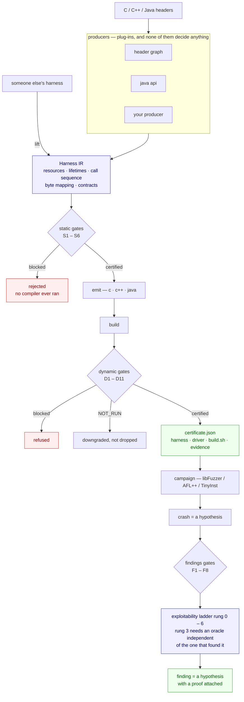

# Harness Forge

**A certification authority for fuzzing harnesses. Generators are plug-ins.**

The field builds generators. The field's own numbers say the generator is not the
bottleneck: harness defects produce false-positive crash rates **as high as 94%**, and an
audit of **586 production harnesses** found 53 protocol violations, 35 of which were fixed
upstream. The bottleneck is that nobody can tell you whether a harness is any good until
after it has wasted a campaign or produced a false finding.

So this is not a generator. It is an **IR**, a **gate bank** and an **evidence record**.
A producer proposes a plan; the gates certify it; confidence decides nothing.

---

## Where this stands

<!-- PHASES:BEGIN -->

| phase | | done | |
|---|---|---|---|
| `P1` | IR, static gates, C emitter | 6/6 | **done** |
| `P2` | dynamic gates and positive control | 6/6 | **done** |
| `P3` | producers: test-lift, LLM->IR, graph traversal | 52/63 | partial |
| `PX` | cross-platform hardening: run the same way on every host | 5/5 | **done** |
| `T0` | target choice, seeds and input size: the work that decides findings | 5/5 | **done** |
| `TF` | findings: the half the engine was missing | 5/5 | **done** |
| `M` | the model gets hands on the engine, never on the arbiter | 7/7 | **done** |
| `L` | language coverage beyond C | 8/10 | partial |
| `P4` | lift-and-grade third-party harnesses | 3/4 | partial |
| `P5` | Windows and closed binary | 0/2 | planned |
| `P6` | GUI track | 0/3 | planned |
| `P7` | mobile: Android and iOS | 0/3 | partial |
| `P8` | snapshot and scale | 0/2 | planned |
| `P9` | exotic targets | 0/2 | planned |

**97 of 123 deliverables done**, and `plancheck` refuses to let any of them say so without a module that imports and a test that exists.

<!-- PHASES:END -->

Generated from the manifest by `python3 tools/phase_table.py --write`, because a
hand-maintained status drifts — this one had understated itself by five completed phases.

---

## The pipeline



A gate never returns a boolean. It returns a verdict and the evidence behind it, and
`NOT_RUN` is a **third outcome** — so a check that could not run never reads as one that
passed.

---

## Try it

No installation, no build step, nothing beyond a C compiler. Captured from real runs against
the demo library in [`examples/lib/`](examples/lib/), so a clone and a paste gets the same.

### Point it at a library

Nothing here needs a hand-written plan. Give it the public header and the include paths:

```console
$ python3 -m hforge propose /b/libyaml/include/yaml.h \
    --include /b/libyaml/include --include /b/libyaml/src --name libyaml

116 plan(s) proposed from /b/libyaml/include/yaml.h, written to build/proposed/

RANK  PLAN                               BLOCK   EDGES  GREW   KILL  SINKS  N/RUN  WARN
--------------------------------------------------------------------------------------
 1    libyaml_yaml_alias_event_initiali      0       ?     ?    0%    0%      0     0
 2    libyaml_yaml_alias_event_initiali      0       ?     ?    0%    0%      0     0
 ...
x115  libyaml_yaml_document_get_node_wi      1       ?     ?    0%    0%      0     0
x116  libyaml_yaml_document_get_node_wi      1       ?     ?    0%    0%      0     0

Winner: libyaml_yaml_alias_event_initialize (producer: header_graph).
Selected by gate evidence. No producer supplied a score, a confidence or a preference.
```

An `x` prefix means a static gate blocked that plan; it is reported, not hidden. **Read the
`?` column before the ranking.** `EDGES` is unknown because no campaign has run, so this
ranking is ordered by static evidence alone — and it shows: the plan at the top initialises
an alias event, which is not where YAML parses anything. Static gates prove a harness is not
wrong. They cannot tell you which correct harness is worth running.

That is what `batch` is for. It generates every plan, gates them all, gives the survivors a
real campaign, and ships only what earns it:

```console
$ python3 -m hforge batch /b/libyaml/include/yaml.h \
    --source /b/libyaml/src/api.c --source /b/libyaml/src/parser.c \
    --include /b/libyaml/include --top 32 --campaign-seconds 60
```

`--top` bounds how many get a campaign; the rest are reported as unmeasured rather than as
passing. Add `--classpath` in place of the header to drive the Java producer and the Jazzer
backend instead.

### Grade a harness somebody else wrote

The same gate bank runs against harnesses this engine did not write — yours, or a
generator's you are evaluating:

```console
$ python3 -m hforge audit path/to/their_fuzzer.c
$ python3 -m hforge audit target/classes --classpath app.jar
```

`audit` lifts the harness into the same IR and grades it, so a third-party harness and a
generated one are judged by identical criteria.

### Handing the harness to a fuzzer

This engine certifies harnesses. It does not hunt bugs with them, and the certificate says
so: it names what the harness *cannot* find. Something still has to run the campaign and
prove what it finds.

[**Nemesis Forge**](https://github.com/eobi/nemesisforge) is built for the second half, on
the same principle as this one — a model may propose, and may certify nothing; oracles that
are deterministic and independent of the proposer decide what a finding is worth. It uses
the **same 0-6 rung ladder** this repository does, which is what lets the two compose
instead of merely coexisting.

Get it — standard library only, no server, no key:

```bash
git clone https://github.com/eobi/nemesisforge.git
cd nemesisforge && python -m forge doctor
```

`doctor` reports which lenses are present **and what each absence costs**, so a null result
is never mistaken for a completed search. Then the whole pipeline:

```console
$ python3 -m hforge propose cJSON.h --include . --name cjson
451 plan(s) proposed

$ python3 -m hforge validate build/proposed/cjson_cJSON_ParseWithLength.hir.json
[PASS] S1..S6   the plan is contract-compliant

$ python3 -m hforge emit build/proposed/cjson_cJSON_ParseWithLength.hir.json -o out
wrote out/harness.c

$ python -m forge lab out/harness.c --fuzz-time 20       # Nemesis Forge
[21:12:34] job=lab-768ee174 harness=out/harness.c fuzz_time=20s provider=null
[21:12:34] 0 finding(s)
```

Zero findings on cJSON 1.7.18 is the right answer for a pinned release OSS-Fuzz has hammered
for years — and it is only readable beside a positive control, which their tree ships:
`forge lab examples/harness_trunc.c` reaches **rung 1 in 54 executions** on the same machine.

`forge lab` builds one translation unit, so point it at a single-file library or place the
harness beside the sources it includes; `out/build.sh` records the exact build this engine
used. Nemesis Forge also exposes an MCP surface (`python -m forge_mcp --ring2`), so an agent
can drive certify-then-campaign without a shell.

A **certificate** states what the harness cannot reach. A **finding** states what the
campaign did not prove. Neither hides its gaps, and between them there is no step where
somebody has to take it on trust that the harness was correct — which is the step that
makes most fuzzing results unreviewable.

The pairing is worth more than convenience. Nemesis Forge's harness synthesiser asks a model,
in a prompt, for the properties this engine proves mechanically: do not pass fuzz bytes as a
size or a filename, never leave a required pointer NULL, size output buffers for the one call
that uses them, call only what the public header declares. It then checks one of them — a
coverage probe, after a compiler and a campaign have already been paid for. `S2` and `S4`
refuse those plans before `clang` starts.

`hforge audit` runs the same gate bank against harnesses this engine did not write, so a
model-written harness and a generated one are judged by identical criteria.

---

### Pointing it at a target, by platform

The engine is one pipeline with several backends, and they are not equally finished. This
table is the honest state; `python3 -m hforge platforms` prints the full matrix with the
trust ceiling each one carries, and `doctor` reports what your own machine can prove.

| target | status | how you point it |
|---|---|---|
| **Linux CLI** (native or Docker) | verified end to end — 92 tests, 11/11 runnable stages | `hforge batch <header> --source ...` |
| **Linux GUI** | early: file-drop driver and AT-SPI dialog automation both PARTIAL, coverage-guided termination PLANNED | not yet a supported entry point |
| **Android CLI** | verified end to end on arm64-v8a API 35: cross-build, push, run, differential | `--platform android-arm64-emulator` |
| **Android GUI** | planned, next after Linux GUI | — |
| **macOS** arm64 | verified end to end | `hforge batch ...` natively |
| **JVM / Java** | Jazzer backend, own gates and sink ladder | `--classpath app.jar` in place of the header |
| **Windows** | exit-code semantics implemented and unit-tested from any host, **never run on a Windows host** | after the mobile track |
| **iOS** | simulator detected via `simctl`; harness emission not yet wired | — |

**Linux, in Docker.** The benchmark image is the reference environment — it fixes the
compiler, the sanitizer and the coverage tooling, so two runs differ in the engine and in
nothing else. Mount the repository read-only and the work directory writable:

```console
$ docker run --rm -v "$PWD:/hf:ro" -v /tmp/hf-work:/b hforge-linuxbench \
    python3 -m hforge batch /b/libyaml/include/yaml.h \
      --source /b/libyaml/src/api.c --source /b/libyaml/src/parser.c \
      --include /b/libyaml/include --top 32 --campaign-seconds 60 -o /b/out
```

`benchmarks/fetch.sh` populates `/b` with every benchmark target at a pinned revision and
writes `versions.json`, so a coverage figure can name the source it describes.

**Android.** The same command with a platform selector. Check what is attached first —
`devices` lists Android devices and iOS simulators, and `selftest` will tell you which
stages your host can actually run rather than reporting a skip as a pass:

```console
$ python3 -m hforge devices
$ python3 -m hforge selftest --abi arm64-v8a --api 29
[ PASS ] android cross-build   arm64-v8a api29 with asan (downgraded from hwasan:
                               stock system image; HWASan needs a HWASan image)
[ PASS ] android device run    emulator-5554: ok
```

That downgrade line is the point: the harness records that it got ASan where it asked for
HWASan, so a certificate never claims a sanitizer the run did not have.

**Roadmap.** P1 and P2 (IR, static gates, C emitter, dynamic gates) are done. P3 producers
and P4 third-party audit are partial. P7 mobile is partial and active. P5 Windows, P6 GUI,
P8 snapshot-and-scale and P9 exotic targets are planned, in roughly that order.

### Reject a bad plan before any compiler runs

```console
$ python3 -m hforge validate examples/hf_demo.broken.hir.json

[PASS] S1  lifetime: created once, destroyed once, never used after
[FAIL] S2  contract: NUL-termination, (ptr,len) pairs, ownership, non-null
        [block] S2.CSTRING: op o_parse: hd_parse requires 'json' to be NUL-terminated,
                but slice 'json' is kind='bytes' and adds no terminator. The library will
                read past the end of EVERY input, so every input becomes a crash and every
                finding is the harness's own.
                fix: set slice 'json' kind to 'cstring', or call the length-delimited
                     variant of hd_parse instead

3 blocking violation(s). This plan must not be emitted as-is.
```

That harness would have produced a crash on the first input and a bug report on the first
day. **No compiler, no campaign, 40 milliseconds.**

### Certify a good one end to end

```console
$ python3 -m hforge certify examples/hf_demo.good.hir.json --campaign-seconds 8

HARNESS CERTIFICATE   hf_demo_parse   [PROVISIONAL]
target      hf_demo 0.1 local        max rung 5 (best: linux-x86_64-glibc)

  PASS  S1..S6   lifetime, contract, ordering, boundary, input flow, error handling
  PASS  D1..D8   liveness, positive control, valid input, sinks, rate, determinism,
                 knobs, campaign productivity
    -   D9   misuse provenance
           reason: no sanitizer report to attribute. This gate runs when a campaign
                   produces a crash, not during certification of a clean harness.
    -   D11  differential consistency across producers
           reason: only 1 buildable plan for this entry point; consistency needs at
                   least two producers to have emitted one

WHAT THIS HARNESS CANNOT FIND
  - any input larger than 4096 bytes cannot be generated
  - leaks are not detected: LeakSanitizer is off
  - uninitialised-memory reads are not detected: MemorySanitizer is off
  - gate D9 did not run: no sanitizer report to attribute
  - gate D11 did not run: only 1 buildable plan for this entry point
```

*(abridged: the gate lines are individually printed, and the platform list and reachability
hypotheses are cut.)* Three things here exist in no other harness generator I know of.

**`-` is not `PASS`.** D9 and D11 did not run, and the certificate says so in the same
column, with the reason. A missing check never reads as a satisfied one.

**`WHAT THIS HARNESS CANNOT FIND` is generated**, computed from the knobs and sanitizers
actually in force. When this harness reports nothing, that block is the honest scope of the
silence — the difference between "no bugs" and "no bugs *of the kinds this configuration can
observe*".

**`[PROVISIONAL]`** because `max rung 5`: the ladder's top rung needs an oracle independent
of the one that found the crash, and certification alone cannot supply it.

### The rest

| | |
|---|---|
| `propose <header> --source <c> --dynamic` | ranks candidate plans by **mutation kill rate**, not by anyone's preference |
| `audit <their-harness.c>` | grades a harness somebody else wrote; low-fidelity lifts are tracked separately and never scored as defects |
| `batch --target <name> --source <dir>` | every plan for a target, gated, campaigned, and only the ones that reach code get shipped |
| `doctor` / `selftest` | what this machine can do, and what each missing tool **costs** |

Against libmagic, `batch` proposed 36 plans, rejected 2 before a compiler ran, shipped 26,
and refused 10 for reaching fewer than 8 edges — **28% of what a conventional generator would
ship reaches essentially nothing**, identified in under a minute. More in
[`docs/EVIDENCE.md`](docs/EVIDENCE.md).

## Beyond this page

| | |
|---|---|
| [`docs/EVIDENCE.md`](docs/EVIDENCE.md) | the measured claims — detection rates, mined dictionaries and seeds, scale, ten real libraries, and the two limitations and what closing them cost |
| [`docs/PLATFORMS.md`](docs/PLATFORMS.md) | the 24-platform matrix with trust ceilings, and how to verify Linux on your own machine |
| [`benchmarks/RANKING.md`](benchmarks/RANKING.md) | the full protocol, the denominator rule, and what is deliberately not measured |
| [`SECURITY.md`](SECURITY.md) | disclosure, and why nothing here will call a finding a zero-day |
| [`CONTRIBUTING.md`](CONTRIBUTING.md) | adding a producer, a gate, or a benchmark case |

---

## Why an IR

Every published generator emits C for one backend. A harness validated for libFuzzer on
Linux tells you nothing about the same API under TinyInst on Windows, and its defects are
only discoverable by compiling and running it.

Here a harness is a **plan**: a resource graph with lifetimes, a call sequence, a mapping
from fuzzer bytes to arguments, and the API contracts the plan must respect.

1. **One plan, many backends.** The same IR emits a libFuzzer harness, an AFL++ persistent
   loop, a TinyInst in-process driver, a GUI file-drop driver, or an interpreter program.
   Certified semantics travel across OS and architecture.
2. **Gates before compilation.** Lifetime correctness, protocol compliance and ordering are
   properties of the plan.
3. **The IR is the certifiable artifact.** Versionable, diffable, publishable.
4. **Third-party harnesses lift into it**, so somebody else's C can be graded.

---

## The gates

**Static — on the plan, before a compiler exists**

| | | principle |
|---|---|---|
| S1 | lifetime: created once, destroyed once, never used after | P1 |
| S2 | contract: NUL-termination, (ptr,len) pairs, ownership, non-null | P2 |
| S3 | ordering: create before use before destroy | P2 |
| S4 | boundary: public interface only | P3 |
| S5 | input flow: the fuzzer's bytes reach the target | P4 |
| S6 | error handling: failure returns checked before use | P1 |

**Dynamic — against a build**

| | | phase |
|---|---|---|
| D1 | liveness: the target call survived the optimiser | 1 |
| D2 | positive control: the harness finds a planted bug | 2 |
| D3 | valid input must not crash | 1 |
| D4 | sink reachability | 2 |
| D5 | execution rate is plausible | 1 |
| D6 | determinism, reported as a **rate** | 1 |
| D7 | knobs recorded, and **what they exclude computed** | 1 |
| D9 | misuse provenance | 2 |
| D11 | differential consistency across producers | 2 |

A gate never returns a boolean. It returns a verdict plus the evidence, and **NOT RUN is a
distinct outcome** so an absent check never reads as a passed one.

---

## Measured against the state of the art

Against **QuartetFuzz** — the strongest published LLM-driven harness generator, 3 CVEs, 29
confirmed reports — on its own 100-case benchmark with its gold OSS-Fuzz baselines.
**The protocol is theirs and it favours them:** gold and QuartetFuzz are the median of ten
600 s runs, ours is **one**.

### 600 s per case, Linux aarch64, clang 14

<!-- BENCH:BEGIN -->

| case | ours | QuartetFuzz | gold | ours/gold | QF/gold |
|---|---|---|---|---|---|
| libyaml/libyaml_loader_fuzzer | **73.69** | 73.89 | 77.7 | 0.95x | 0.95x |
| libyaml/libyaml_scanner_fuzzer | **70.48** | 67.30 | 70.6 | 1.00x | 0.95x |
| brotli/decode_fuzzer | **84.95** | 84.15 | 77.2 | 1.10x | 1.09x |
| yajl-ruby/json_fuzzer | *NO PLAN for the gold target* | 79.87 | 69.1 |  | 1.16x |
| iperf/cjson_fuzzer | **24.82** | 0.00 | 24.5 | 1.01x | 0.00x |
| zopfli/zopfli_deflate_fuzzer | **76.51** | 80.06 | 85.7 | 0.89x | 0.93x |
| zlib/zlib_uncompress2_fuzzer | **51.91** | 51.74 | 53.1 | 0.98x | 0.97x |
| lcms2/cmsOpenProfileFromMem | **5.00** | — | — |  |  |
| libde265/stream_decode | **13.99** | — | — |  |  |
| jbig2dec/jbig2_data_in | **2.58** | — | — |  |  |
| leptonica/pixReadMem | *build failed* | — | — |  |  |
| jansson/json_loadb | *build failed* | — | — |  |  |
| libwebp/WebPDecodeRGBA | **50.73** | — | — |  |  |
| libpng/png_image_begin_read_from_memory | *NO PLAN for the gold target* | — | — |  |  |
| expat/XML_Parse | **22.80** | — | — |  |  |
| zstd/ZSTD_decompress | **30.04** | — | — |  |  |
| mbedtls/mbedtls_x509_crt_parse | **12.22** | — | — |  |  |

Measured cases with a gold baseline: **6**. Median ours/gold: **0.99x**. Ahead of the cited QuartetFuzz figure on **4 of the 6** cases it published one for.

Sources: run-001-quartetfuzz-6case, run-005-partial, run-007-partial-4of7, run-009, run-010, run-011, run-012, run-013, run-014, run-015, run-016, run-017, run-018, run-019, run-020, run-021, run-022, run-023, run-024, run-026.

<!-- BENCH:END -->

### What this table does not establish

Four limits, stated because the numbers above are easy to over-read.

**It shows parity, not superiority.** The median is **0.99x**, and it is worth saying how
that number arrived. Until run-026 this table read 1.02x, measured against source trees
cloned by hand at unrecorded revisions. Re-running every case against pinned sources moved
the median to 0.99x -- from a shade ahead of the hand-written harness to a shade behind it.
The spread across the six head-to-head cases is 0.89x (zopfli) to 1.10x (brotli), and only
brotli is plausibly outside the run-to-run noise of a single campaign. The defensible claim
is that an engine with no model in the loop reaches roughly what the hand-written harness
reaches. It is not a claim of beating gold, and the earlier number should not be quoted.

**Our figures are single runs; theirs are medians of ten.** That asymmetry is stated above,
but its size was not measured until run-025 re-ran the suite against pinned sources:
`libyaml/libyaml_loader_fuzzer` moved from 77.77 to 73.16, 4.6 points, on a case that had
looked stable. Whether that is the version pin or ordinary campaign variance is not yet
separated. Until this repository runs repetitions, ratios here should not be read to two
decimal places.

**The seven head-to-head cases are not a representative sample.** Their gold coverage
averages 62.3%. Across QuartetFuzz's full 100-case set the gold median is 18.06%, ranging
from 0.20% to 87.32%. These seven are the targets where a harness can get deep, and a
parser-shaped engine looks better on them than it would on a hundred.

**The gold column has been superseded for three of the seven.** These figures come from the
artifact's `dataset/gold_baseline_100.jsonl`, whose protocol is not documented there. The
authors' newer `dataset_v2` re-measures gold by replaying each project's official OSS-Fuzz
corpus, scoped to the project's own sources, and disagrees where the two overlap: libyaml
scanner 70.6 -> 53.2, libyaml loader 77.7 -> 78.2, zlib 53.1 -> 55.4. The remaining four
cases are not in that set, so switching columns piecemeal would mix two protocols in one
table. The honest resolution is to run the newer set, not to relabel these rows.

**`ours/gold` is the number that matters.** Absolute coverage is a property of the target —
85% on brotli and 53% on zlib say nothing about each other. For scale, QuartetFuzz's own
median across its 25 C cases is **0.95x**: the state of the art is still, on median, slightly
behind the hand-written harness it is replacing.

**`iperf/cjson_fuzzer`, QuartetFuzz 0.00** — not a low score, no working harness at all. That
is the failure mode the gate bank exists to make visible.

**`lcms2` has no baseline in this table** because it is not in QuartetFuzz's evaluation
set. An earlier draft said no public OSS-Fuzz harness existed for the entry point and that a
model could not have memorised it. Both were false: OSS-Fuzz ships `cms_md5_fuzzer`, which
calls `cmsOpenProfileFromMem` directly. That harness replays its official corpus to
**5.107%** against a denominator of its own, beside the **5.14%** measured here — not a
cell-to-cell comparison, but close enough to suggest ~5% is simply what one entry point
reading an ICC profile reaches. The row earns its place a different way: pointing the engine
at lcms2 found **five defects in this engine** that seven benchmark cases never exposed.

**`libde265`'s gold figure is one we measured**, marked †: the project ships its own harness,
so we built theirs and ran it here under identical conditions. It disproved what we expected.
Our plan calls `de265_decode` once where theirs pumps it in a loop — a real gap that cost
**0.25 points**, because the entire H.265 decode core is at **0.00% for the hand-written
harness too**. On that target the input is the bottleneck, not the harness.

Protocol, the denominator rule and its ceiling argument, and what is deliberately not
measured: [`benchmarks/RANKING.md`](benchmarks/RANKING.md).

**QuartetFuzz has 3 CVEs. This repository has none.** Coverage is instrumentation, not the
product.

---

## Layout

```
hforge/
  ir.py            the Harness IR — resources, lifetimes, ops, slices, scratch
  manifest.py      every deliverable, its status, and what backs it
  producers/       header_graph (C) · cxx_header · java_api · rank
  emit/            the language router, then c_libfuzzer · cxx_libfuzzer · java_jazzer
  gates/           static_gates S1..S6 · dynamic_gates D1..D11
  findings/        F1..F8, the exploitability ladder, our own false-positive rate
  java/            the parallel JVM track   lift/  grade someone else's C
  analysis/        sink map, mined dictionaries, mined seeds
benchmarks/        drive.py · rank.py · run.sh · reference.json · results/logs/
examples/lib/      a tiny demo library, so this runs on a clean clone
docs/              EVIDENCE.md — the measured claims   PLATFORMS.md — the matrix
```

## Checks

```
pip install pytest && python3 -m pytest -q     # 326 passed
python3 tools/plancheck.py                     # repository vs manifest: no drift
python3 -m hforge selftest                     # the pipeline, end to end, on this machine
```

326 tests across eleven files, each pinning a failure that really happened rather than a
function that exists. **`plancheck` is a gate, not a report**: every deliverable the manifest
marks `DONE` must name a module that imports and a test that exists, and CI fails when one
does not. That is what makes the status table above worth reading.

---

## Citing this work

GitHub renders a **Cite this repository** button from [`CITATION.cff`](CITATION.cff).

```bibtex
@software{obiebukadavid_harnessforge_2026,
  author  = {{Obi Ebuka David}},
  title   = {{Harness Forge}: a certification authority for fuzzing harnesses},
  year    = {2026},
  version = {0.1.0},
  url     = {https://github.com/eobi/harness-forge},
  license = {Apache-2.0},
  note    = {Department of Computer Science, University of Dayton, Ohio, USA}
}
```

The double braces are deliberate: without them most BibTeX styles reorder the name to
"David, O. E."

> Obi Ebuka David (2026). *Harness Forge: a certification authority for fuzzing harnesses*
> (version 0.1.0) [Computer software]. Department of Computer Science, University of
> Dayton, Ohio, USA. https://github.com/eobi/harness-forge

**Cite the commit, not the branch.** Three producer fixes landed within twenty minutes of
run-009's last case finishing, and any one changes what a harness looks like — which is why
every row in [`benchmarks/results/`](benchmarks/results/) carries the engine revision that
emitted its harness, `-dirty` included. Add `note = {Commit f2f55b7}`. For a DOI, enable
Zenodo and cut a release; it reads `CITATION.cff` directly.

**Citing a number rather than the software?** Cite the run. Each figure is reproducible from
the row (`benchmarks/results/<run-id>.jsonl`), the evidence
(`benchmarks/results/logs/<run-id>/<case>/`) and the command (`benchmarks/run.sh`). And carry
the distinction the tables carry: a figure this repository **measured** and one someone else
**published** are different kinds of evidence — see [`THIRD-PARTY.md`](THIRD-PARTY.md).

## Licence

Apache-2.0. See [LICENSE](LICENSE).
