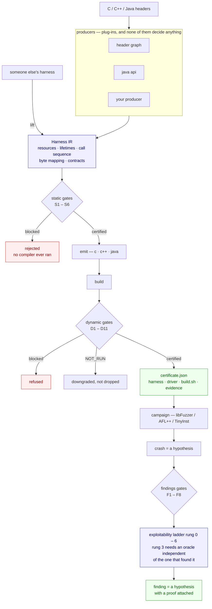

# Harness Forge

**A certification authority for fuzzing harnesses. Generators are plug-ins.**

The field builds generators. The field's own numbers say the generator is not the
bottleneck: harness defects produce false-positive crash rates **as high as 94%**, and an
audit of **586 production harnesses** found 53 protocol violations, 35 of which were fixed
upstream. The bottleneck is that nobody can tell you whether a harness is any good until
after it has wasted a campaign or produced a false finding.

So this is not a generator. It is an **IR**, a **gate bank** and an **evidence record**.
A producer proposes a plan; the gates certify it; confidence decides nothing.

---

## Where this stands

<!-- PHASES:BEGIN -->

| phase | | done | |
|---|---|---|---|
| `P1` | IR, static gates, C emitter | 6/6 | **done** |
| `P2` | dynamic gates and positive control | 6/6 | **done** |
| `P3` | producers: test-lift, LLM->IR, graph traversal | 30/35 | partial |
| `PX` | cross-platform hardening: run the same way on every host | 5/5 | **done** |
| `T0` | target choice, seeds and input size: the work that decides findings | 5/5 | **done** |
| `TF` | findings: the half the engine was missing | 5/5 | **done** |
| `M` | the model gets hands on the engine, never on the arbiter | 7/7 | **done** |
| `L` | language coverage beyond C | 8/10 | partial |
| `P4` | lift-and-grade third-party harnesses | 3/4 | partial |
| `P5` | Windows and closed binary | 0/2 | planned |
| `P6` | GUI track | 0/3 | planned |
| `P7` | mobile: Android and iOS | 0/3 | partial |
| `P8` | snapshot and scale | 0/2 | planned |
| `P9` | exotic targets | 0/2 | planned |

**75 of 95 deliverables done**, and `plancheck` refuses to let any of them say so without a module that imports and a test that exists.

<!-- PHASES:END -->

Regenerate with `python3 tools/phase_table.py --write`. It is generated because the heading
here used to read "phases 1, 2, and half of 3" and stayed that way long after P3 reached 28
of 33 and five other phases had finished — a hand-maintained status drifts in whichever
direction flatters whoever touched it last, and this one drifted *downward*.

The single check that makes the rest of this page worth reading:

```
$ python3 -m hforge validate examples/hf_demo.broken.hir.json

[PASS] S1  lifetime: created once, destroyed once, never used after
[FAIL] S2  contract: NUL-termination, (ptr,len) pairs, ownership, non-null
        [block] S2.CSTRING: op o_parse: hd_parse requires 'json' to be NUL-terminated,
                but slice 'json' is kind='bytes' and adds no terminator. The library will
                read past the end of EVERY input, so every input becomes a crash and every
                finding is the harness's own.
                fix: set slice 'json' kind to 'cstring', or call the length-delimited
                     variant of hd_parse instead
...
3 blocking violation(s). This plan must not be emitted as-is.
Note that every one was found WITHOUT compiling anything.
```

That is the cJSON exact-size-buffer defect, the one that produced eight false reports
against a library that was behaving correctly, caught in the plan. No compiler ran.

Then the whole pipeline:

```
$ python3 -m hforge certify examples/hf_demo.good.hir.json --valid-corpus examples/corpus
```

emits C, builds it, runs the dynamic gates, and prints a certificate whose last section is
the one nobody else prints: **what this harness cannot find.**

---

## The pipeline



A gate never returns a boolean. It returns a verdict and the evidence behind it, and
`NOT_RUN` is a **third outcome** — so a check that could not run never reads as one that
passed.

---

## Where the engine stands


---

## Try it — five commands, and the output they actually print

No installation, no build step, no dependencies beyond a C compiler. The first four blocks
are captured from real runs against the demo library in [`examples/lib/`](examples/lib/), so
`git clone` and paste gets you the same thing. Nothing in them is invented; the certificate
in block 3 is the only one shortened, by cutting two whole sections (the platform list and
the reachability hypotheses) and wrapping the long gate warnings. The fifth block needs a
library you supply, so it is described rather than transcribed.

### 1. Propose harnesses from a header, and rank them by evidence

```console
$ python3 -m hforge propose examples/lib/hf_demo.h --source examples/lib/hf_demo.c --dynamic

4 plan(s) proposed from examples/lib/hf_demo.h, written to build/proposed/

RANK  PLAN                               BLOCK   EDGES  GREW   KILL  SINKS  N/RUN  WARN
--------------------------------------------------------------------------------------------
 1    hf_demo_hd_parse_n_len64k              0       ?     ?  100%   67%      3     0
 2    hf_demo_hd_parse_n                     0       ?     ?  100%   67%      3     1
 3    hf_demo_hd_parse_len64k                0       ?     ?   50%  100%      3     0
 4    hf_demo_hd_parse                       0       ?     ?   50%  100%      3     1

Winner: hf_demo_hd_parse_n_len64k (producer: header_graph).
Selected by gate evidence. No producer supplied a score, a confidence or a preference.
```

`KILL` is the mutation-testing rate — of the defects deliberately planted in the target, how
many this harness catches. That is why the length-delimited variant wins over the plain one:
not because a model preferred it, but because it killed twice as many planted bugs.

### 2. Reject a bad plan before any compiler runs

```console
$ python3 -m hforge validate examples/hf_demo.broken.hir.json

[PASS] S1  lifetime: created once, destroyed once, never used after
[FAIL] S2  contract: NUL-termination, (ptr,len) pairs, ownership, non-null
        [block] S2.CSTRING: op o_parse: hd_parse requires 'json' to be NUL-terminated,
                but slice 'json' is kind='bytes' and adds no terminator. The library will
                read past the end of EVERY input, so every input becomes a crash and every
                finding is the harness's own.
                fix: set slice 'json' kind to 'cstring', or call the length-delimited
                     variant of hd_parse instead

3 blocking violation(s). This plan must not be emitted as-is.
```

That harness would have produced a crash on the first input and a bug report on the first
day. **Cost to find it: no compiler, no campaign, 40 milliseconds.**

### 3. Certify a good one end to end

```console
$ python3 -m hforge certify examples/hf_demo.good.hir.json --campaign-seconds 8

==========================================================================
HARNESS CERTIFICATE   hf_demo_parse   [PROVISIONAL]
==========================================================================
target      hf_demo 0.1 local
producer    hand
ir sha256   39f0c906a40055d90ea06a728468daf9...
max rung    5 (best: linux-x86_64-glibc)

GATES
  PASS  S1   lifetime: created once, destroyed once, never used after
  PASS  S2   contract: NUL-termination, (ptr,len) pairs, ownership, non-null
  PASS  S3   ordering: create before use before destroy
  PASS  S4   boundary: public interface only
  PASS  S5   input flow: the fuzzer's bytes reach the target
  PASS  S6   error handling: failure returns are checked before use
  PASS  D1   liveness: the target call survived the optimiser
  PASS  D2   positive control: the harness finds a planted defect
  PASS  D3   valid input must not crash
  PASS  D4   sink reachability: fraction of the sink surface reached
  PASS  D5   execution rate is plausible
  PASS  D6   behaviour is deterministic across identical runs
  PASS  D7   knobs recorded, and what they exclude computed
           [warn ] D7.DEFAULT_MAX_LEN: max_len is 4096, at or below libFuzzer's silent
                   default. A defect needing a larger input is not hard to find here, it is
                   IMPOSSIBLE TO EXPRESS, and no amount of runtime changes that.
  PASS  D8   campaign productivity: edges the fuzzer can actually see
    -   D9   misuse provenance: harness-allocated or library-allocated
           reason: no sanitizer report to attribute. This gate runs when a campaign
                   produces a crash, not during certification of a clean harness.
    -   D11  differential consistency across producers
           reason: only 1 buildable plan(s) for this entry point; consistency needs at
                   least two producers to have emitted one

WHAT THIS HARNESS CANNOT FIND
  - any input larger than 4096 bytes cannot be generated
  - leaks are not detected: LeakSanitizer is off
  - uninitialised-memory reads are not detected: MemorySanitizer is off
  - integer truncation and other undefined behaviour is not detected at the arithmetic;
    only its downstream memory error is
  - gate D9 did not run: no sanitizer report to attribute
  - gate D11 did not run: only 1 buildable plan for this entry point

REPRODUCTION
  build  $CC -g -O1 -fno-omit-frame-pointer -Iexamples/lib -fsanitize=fuzzer,address \
             harness.c examples/lib/hf_demo.c -o hf_demo_parse_fuzz
  env    ASAN_OPTIONS=abort_on_error=0:detect_leaks=0:allocator_may_return_null=1
  run    ./hf_demo_parse_fuzz corpus/ -max_len=4096 -timeout=25 -rss_limit_mb=2048
==========================================================================
```

Three things here exist in no other harness generator I know of.

`-` **is not `PASS`.** D9 and D11 did not run, and the certificate says so in the same
column, with the reason. A missing check never reads as a satisfied one.

**`WHAT THIS HARNESS CANNOT FIND` is generated, not written.** It is computed from the knobs
and sanitizers actually used. When this harness reports nothing, that block is the honest
scope of the silence — and it is the difference between "no bugs" and "no bugs *of the kinds
this configuration can observe*".

**`[PROVISIONAL]`** because `max rung 5`: the ladder's top rung needs an oracle independent
of the one that found the crash, and certification alone cannot supply it.

### 4. Grade a harness somebody else wrote

```console
$ python3 -m hforge audit path/to/their/harness.c

  3 call(s), 1 resource(s), 1 value(s) the lifter could not attribute
  [BLOCK] S5.INPUT_NOT_CONSUMED: no op receives fuzzer input; the harness runs a fixed
          program and the campaign cannot find anything

==========================================================================
AUDITED 1 harness(es) from 1 file(s)
==========================================================================
  blocking defects : 1   (high-fidelity lifts only)
  warnings         : 2
  low fidelity     : 0   NOT counted as defects
  not liftable     : 0

Contract gates (S2) need the target's headers. Without them they report what
they could check and NOT RUN for the rest, rather than guessing — a harness
graded on a guess is worse than one not graded at all.
```

Point it at an OSS-Fuzz project directory and it grades the whole set. **`low fidelity` is
tracked separately and never counted as a defect**, because a harness the lifter only partly
understood must not be scored as a harness that is wrong.

### 5. Run the whole thing against a real library

```
python3 -m hforge batch --target libmagic --source /path/to/file-5.44 --top 32
```

`batch` proposes every plan for a target, gates them all, runs a short campaign on the ones
that survive, and ships only those a real campaign shows reach into the code. Against
libmagic (`file` 5.44, from source) that produced:

| | |
|---|---|
| plans proposed | 36 |
| rejected before a compiler ran | 2 |
| **reach ≥ 8 edges — shipped** | **26** |
| **reach < 8 edges — refused** | **10** |

**28% of what a conventional generator would ship reaches essentially nothing** — and the
engine says which, in under a minute, before any campaign budget is spent. Each shipped
harness lands in `out/` as `harness.c`, `driver.c`, `build.sh` and `certificate.json`,
enough to reproduce the result without this tool.

---

## Why an IR

Every published generator emits C for one backend. A harness validated for libFuzzer on
Linux tells you nothing about the same API under TinyInst on Windows, and its defects are
only discoverable by compiling and running it.

Here a harness is a **plan**: a resource graph with lifetimes, a call sequence, a mapping
from fuzzer bytes to arguments, and the API contracts the plan must respect.

1. **One plan, many backends.** The same IR emits a libFuzzer harness, an AFL++ persistent
   loop, a TinyInst in-process driver, a GUI file-drop driver, or an interpreter program.
   Certified semantics travel across OS and architecture.
2. **Gates before compilation.** Lifetime correctness, protocol compliance and ordering are
   properties of the plan.
3. **The IR is the certifiable artifact.** Versionable, diffable, publishable.
4. **Third-party harnesses lift into it**, so somebody else's C can be graded.

---

## The gates

**Static — on the plan, before a compiler exists**

| | | principle |
|---|---|---|
| S1 | lifetime: created once, destroyed once, never used after | P1 |
| S2 | contract: NUL-termination, (ptr,len) pairs, ownership, non-null | P2 |
| S3 | ordering: create before use before destroy | P2 |
| S4 | boundary: public interface only | P3 |
| S5 | input flow: the fuzzer's bytes reach the target | P4 |
| S6 | error handling: failure returns checked before use | P1 |

**Dynamic — against a build**

| | | phase |
|---|---|---|
| D1 | liveness: the target call survived the optimiser | 1 |
| D2 | positive control: the harness finds a planted bug | 2 |
| D3 | valid input must not crash | 1 |
| D4 | sink reachability | 2 |
| D5 | execution rate is plausible | 1 |
| D6 | determinism, reported as a **rate** | 1 |
| D7 | knobs recorded, and **what they exclude computed** | 1 |
| D9 | misuse provenance | 2 |
| D11 | differential consistency across producers | 2 |

A gate never returns a boolean. It returns a verdict plus the evidence, and **NOT RUN is a
distinct outcome** so an absent check never reads as a passed one.

---

## Platforms

`python3 -m hforge platforms` prints the full matrix: Linux (glibc, musl, x86, x86-64,
aarch64), Windows (MSVC, MinGW, x86, x64, ARM64), macOS (Intel, Apple Silicon, arm64e),
Android (emulator and device, arm64/armv7/x86-64), iOS/iPadOS/tvOS (simulator and device).

Each carries its sanitizers, allocator, coverage backends, crash artifact and **trust
ceiling** — the highest ladder rung a finding observed only there may reach.

> **Fuzz where instrumentation is cheap. Prove reachability where the target actually runs.**

An iOS device run is a **reachability oracle**, never the discovery mechanism. A macOS ASan
finding carries an explicit, labelled iOS reachability hypothesis, or an explicit refusal to
make one.

Variant disagreement is itself an oracle: reproduces at 32 bits and not 64 means
width-dependent arithmetic; reproduces on glibc and not musl means allocator-dependent;
reproduces only under DBI means an instrumentation artifact and must not be reported.

---

## Running it on your machine

Three operator commands, in the order you would use them.

```
python3 -m hforge doctor      # what this machine can do, and what each missing tool COSTS
python3 -m hforge devices     # attached Android devices and iOS simulators
python3 -m hforge selftest    # the whole pipeline, end to end, on this host
```

`doctor` reports a missing tool together with what its absence stops you proving, because a
warning with no stated cost is a warning people learn to ignore. `selftest` runs every stage
and distinguishes **SKIP from PASS** — a check this machine could not run is never counted as
one that passed.

On a Mac with the NDK and an emulator attached, all fourteen stages run:

```
[ PASS ] exit-code classification      12 exit codes classified correctly across linux/windows
[ PASS ] static gates REJECT bad plan  blocked by 3 violation(s), incl. S2.CSTRING — no compiler ran
[ PASS ] D2 positive control           mutants_tested=2, killed=1, survived=1
[ PASS ] android cross-build           arm64-v8a api29 with asan (downgraded from hwasan:
                                       stock system image; HWASan needs a HWASan image)
[ PASS ] android device run            emulator-5554: ok
14 passed, 0 failed, 0 skipped
```

### Platform support

| platform | status |
|---|---|
| **macOS** arm64 | verified end to end |
| **Linux** aarch64 glibc | verified end to end — 92 tests, 11/11 runnable stages |
| **Linux** aarch64 musl | verified end to end — different allocator, correctly detected |
| **Linux** x86-64 glibc | verified end to end under emulation |
| **Android** arm64-v8a API 35 | verified end to end: cross-build, push, run, differential |
| **Windows** MSVC / MinGW | exit-code semantics implemented and unit-tested from any host; **not yet run on a Windows host** |
| **iOS** simulator | detected via `simctl`; harness emission not yet wired |

Nothing above claims more than was executed. Windows is honestly *implemented and
unit-tested*, not *verified* — run `python3 -m hforge selftest` there and it will tell you
which of the two it is.

### Verifying Linux yourself

```
./scripts/verify-linux.sh          # needs only a running docker daemon
```

Three containers, because the platform model claims those variants differ and an unexercised
claim is a guess: aarch64/glibc, aarch64/musl, and x86-64/glibc under emulation. The last
step certifies the **same plan** on all three and compares the gate verdicts.

```
GATE   linux-aarch64-glibc linux-aarch64-musl  linux-x86_64-glibc
D1     pass                pass                pass
S2     pass                pass                pass
...
All platforms agree. The harness behaves the same across allocator and word
size, so no variant-dependence is implicated.
```

**A disagreement there is not a build failure.** It is the variant-disagreement oracle
firing: glibc-not-musl means allocator-dependent, x86-64-not-aarch64 means width-dependent
arithmetic. `scripts/compare_certs.py` says which, and exits 0 either way, because a script
that failed the build on real information is a script people stop running.

## The claim, in one table

libmagic (`file` 5.44 from source), one `hforge batch` run, 8-second campaigns:

| | |
|---|---|
| plans proposed | 36 |
| rejected before a compiler ran | 2 |
| **reach ≥ 8 edges — shipped** | **26** |
| **reach < 8 edges — refused** | **10** |

**28% of what a conventional generator would ship reaches essentially nothing**, and the
engine says which in under a minute, before any campaign budget is spent.

The same entry point, proposed three ways and chosen by measurement:

| plan | edges | grew | executions |
|---|---|---|---|
| `magic_buffer` | 36 | no | 6,321,959 |
| `magic_buffer_with_magic_load` | 542 | yes | — |
| `magic_buffer_setup` | **551** | yes | 664,461 |

15× the reach — and the search finds *which* call mattered, rather than assuming. 15x the reach is the argument for an IR: emitting C directly makes this search impossible,
because the thing being compared has already been flattened into text. The side-by-side
against the state of the art is below, and it does not flatter us — QuartetFuzz has 3 CVEs
and this repository has none.

---

## Measured against the state of the art

The comparison is against **QuartetFuzz** — the strongest published LLM-driven harness
generator, four cooperating agents, 3 CVEs and 29 confirmed reports. Its artifact publishes
a 100-case benchmark with gold OSS-Fuzz baselines and per-case results.

Ground rules, because a benchmark whose rules are loose is not evidence:

- **Their artifact is never vendored.** It carries no LICENSE file, so it is read and
  reproduced against, and its numbers appear only as citations keyed by case id. See
  [`THIRD-PARTY.md`](THIRD-PARTY.md).
- **A cell holds either a number we measured or a number somebody published, never both.**
  [`benchmarks/rank.py`](benchmarks/rank.py) enforces this: measured figures can only come
  from `results/`, cited figures only from `reference.json`.
- **The protocol is theirs, and it favours them.** Gold and QuartetFuzz are the median of
  10 x 600 s runs. Ours is **one** 600 s run — a single sample against a median.

### run-009, 600 s, Linux aarch64, clang 14

<!-- BENCH:BEGIN -->

| case | ours | QuartetFuzz | gold | ours/gold | QF/gold |
|---|---|---|---|---|---|
| libyaml/libyaml_loader_fuzzer | **77.77** | 73.89 | 77.7 | 1.00x | 0.95x |
| libyaml/libyaml_scanner_fuzzer | **70.47** | 67.30 | 70.6 | 1.00x | 0.95x |
| brotli/decode_fuzzer | **85.50** | 84.15 | 77.2 | 1.11x | 1.09x |
| yajl-ruby/json_fuzzer | *not yet run* | 79.87 | 69.1 |  | 1.16x |
| iperf/cjson_fuzzer | *not yet run* | 0.00 | 24.5 |  | 0.00x |
| zopfli/zopfli_deflate_fuzzer | *not yet run* | 80.06 | 85.7 |  | 0.93x |
| zlib/zlib_uncompress2_fuzzer | *not yet run* | 51.74 | 53.1 |  | 0.97x |
| lcms2/cmsOpenProfileFromMem | *not yet run* | — | — |  |  |

Measured cases with a gold baseline: **3**. Median ours/gold: **1.00x**. Ahead of the cited QuartetFuzz figure on **3 of 3**.

<!-- BENCH:END -->

**`ours/gold` is the number that matters.** Absolute coverage is a property of the target,
not of the harness — 85% on brotli and 53% on zlib say nothing about each other. The ratio
to the hand-written OSS-Fuzz harness is the only quantity that survives comparison across
libraries. For scale, **QuartetFuzz's own median across its 25 C
cases is 0.95x**, computed from the same published artifact this table cites — the state of
the art is still, on median, slightly behind the hand-written harness it is trying to
replace. (PromeFuzz's 1.40x headline is quoted in `reference.json` and kept out of this
table: we have not reproduced it and do not know its case selection, protocol or
denominator.)

Two rows deserve a second look.

**`iperf/cjson_fuzzer`, QuartetFuzz 0.00.** Not a low score — no working harness at all.
This is the failure mode the gate bank exists to make visible: a generator with no
certification step cannot tell that outcome apart from a hard target.

**`lcms2/cmsOpenProfileFromMem` has no gold and no QuartetFuzz column,** because there is no
public OSS-Fuzz harness for that entry point. It is Tier B of the native attack-surface map
and it is here precisely because **it is the case a language model cannot have memorised** —
lcms2 parses ICC colour profiles inside the JDK, Skia, Pillow and libvips. Pointing the
engine at it found **five defects in this engine** that seven benchmark cases never
exposed, because the benchmark libraries do not spell things the way older C does: `void *`
handle typedefs, a destroy verb in the middle of a name, `dwSize` Hungarian length
parameters. Those five are pinned by
tests and recorded in [`hforge/manifest.py`](hforge/manifest.py) under `P3.NOMINAL`.

Full protocol, the denominator rule and its ceiling argument, and what is deliberately not
measured: [`benchmarks/RANKING.md`](benchmarks/RANKING.md).

### What this table does not say

**QuartetFuzz has 3 CVEs. This repository has none.** Coverage is instrumentation, not the
product. A harness that reaches more of a library is better *positioned* to find a defect,
and being better positioned is not the same as having found one. That column is theirs and
it is the column that counts in the end.

## A dictionary the target wrote itself

A coverage-guided fuzzer finds `CREATE TABLE` by mutating bytes until it stumbles on it.
That is a long walk, and it is unnecessary: **a parser's vocabulary is written down inside
the parser.** `sqlite3.c` contains every SQL keyword it compares against.

```
$ python3 -m hforge batch sqlite3.h --source sqlite3.c ...
$ cat build/suite/sq_sqlite3_exec/target.dict
k0="AND"
k1="BEGIN"
k2="COMMIT"
k3="INTEGER"
k4=":memory:"
...
```

Every shipped harness gets a `target.dict` mined from the target's own string literals, and
gate D8 runs the campaign *with* it and records that it did. The effect is measured, not
assumed. On sqlite, 138 SQL keywords came out of `sqlite3.c` and the same harness over the
same 20 seconds went:

| `sqlite3_exec` | edges | executions |
|---|---|---|
| without dictionary | 867 | 706,530 |
| **with dictionary** | **5,441** | 438,430 |

**6.3x the coverage.** Executions fall because each one does more work: the fuzzer stops
guessing at syntax and starts exercising the engine.

Filtering is deliberately conservative: format specifiers, source file names and camelCase C
symbols are about the program rather than about its input language, and a dictionary full of
them costs the fuzzer time instead of saving it.

## Detection, measured

`--no-positive-control` had hidden this in every earlier run. With D2 enabled on libmagic
(`file` 5.44 from source):

| plan | edges | grew | **kill** | sinks |
|---|---|---|---|---|
| `magic_buffer_setup` | 551 | yes | **83%** | 85% |
| `magic_buffer_with_magic_load` | 547 | yes | **100%** | 84% |
| `magic_file_setup` | 129 | yes | **83%** | 87% |
| `magic_file_with_magic_load` | 124 | yes | **100%** | 87% |

Kill rate is the fraction of *planted* defects the harness detected — mutation testing
against the real target, not a proxy. A harness that reaches deep code and kills nothing is
a harness that will find nothing.

**What D2 costs.** A mutant changes one translation unit, and the build now recompiles only
that unit and links the rest from a cached archive. That is a large win on a 33-file target
like libmagic and **nothing on sqlite**, whose single 243k-line amalgamation has no other
files to reuse. So: D2 is affordable on multi-file targets and a deliberate expense on a
large amalgamation — not, as an earlier note here claimed, simply "affordable".

### Where the defects were caught

```
WHERE THE DEFECTS WERE CAUGHT
  before any compiler ran :    2
        2  S2.TYPE_CONFUSION
  needed a built binary   :    0
  100% of blocking defects cost zero compilation and zero campaign time.
```

This is the axis worth comparing on. The published state of the art intercepts
harness-induced crashes by **running** the harness and attributing the crash afterwards.
Every `S`-coded violation here was found on the plan — no build, no campaign, no triage.

## Seeds from the target's own test data

The dictionary supplies the format's words; a seed supplies a whole sentence. Both are mined
from the repository, and both are measured rather than assumed.

```
python3 -m hforge batch magic.h --source ... --seed-dir /src/file-5.44/tests
```

| `magic_buffer_setup`, 20s | edges |
|---|---|
| no seeds | 565 |
| **117 seeds mined from `file`'s tests** | **634** (+12%) |

Modest here, and worth saying why: the setup variant already calls `magic_load`, so most of
libmagic is reachable before any seed helps. Compare the dictionary's **6.3x** on sqlite,
where the fuzzer had no idea what SQL looked like. The lesson is that neither is a universal
win, which is why D8 reports the number instead of the engine claiming one.

Selection is conservative — de-duplicated by content hash, size-bounded, source files
excluded, deterministic across machines, and a truncated corpus **says** it was truncated.

## Scale

sqlite (243,646 lines, 4,368 functions, 8,116 sinks) is where every performance assumption
broke. Ordering 524 candidates by reachable sink surface took **29 minutes at one core** before
a single harness was built, and it took four attempts to find out why:

| fix | what it actually cost | still slow because |
|---|---|---|
| cache the target archive | 24 rebuilds of 243k lines | the sink map was rebuilt per plan |
| cache the sink map | 52s x 524 | the reachability walk ran per plan |
| cache the walk | 5.6s x 315 distinct entry sets | the walk itself was O(V·E) |
| mark `seen` on enqueue | 5.6s -> 0ms | **`k not in reached` scanned a LIST** |

The last one was the real cost the whole time: `sink_surface` diffed 8,116 sinks against a
list with dataclass equality, once per plan — **66 million comparisons**. The three earlier
fixes were each real and none of them touched it.

Measured on the full workload after all four:

```
build_map              52.4s   (once, cached)
propose 648 plans       0.2s
pre-rank ALL 648       55.5s   -> 86ms each     (was ~29 minutes)
```

Those figures are from the full 648-plan workload, not a sample of it: 315 distinct entry
sets, where a 40-plan slice contains 20 and is mostly cache hits.

## Real targets

Three Linux CLI libraries, in Docker, with nothing special done to them.

| target | plans | winner | verdict | why |
|---|---|---|---|---|
| **libmagic** (`file` 5.44, from source) | 10 | `magic_buffer` | PROVISIONAL | full suite ran; **D2 killed 2 of 6 planted defects** |
| **libyaml** (installed) | 21 | `yaml_parser_set_input_string` | PROVISIONAL | caller-allocated `yaml_parser_t`, chained to `yaml_parser_scan` |
| **libxml2** (`xmllint`, installed) | 74 | `xmlReadMemory` | **REJECTED** | D1: three calls elided by the optimiser |

The libxml2 result is the one to read. The harness built and ran; every static gate passed.
D1 then found that `xmlReadMemory`, `xmlNewDocNode` and `xmlUnlinkNode` did not appear as
undefined symbols in the object, meaning the optimiser had deleted them — *"the campaign
would search an empty function and report nothing."* A generator would have shipped that
harness and it would have fuzzed nothing, forever, silently.

```
python3 -m hforge propose /usr/include/magic.h --name libmagic --link=-lmagic -o out --dynamic
python3 -m hforge certify out/libmagic_magic_buffer.hir.json
```

`--link` gates against an installed library; `--source` and `--cflag=-DHAVE_CONFIG_H` gate
against real sources, which is what D2 and D4 need. Gates that cannot run say so.

## Ten real libraries

Every one parsed and planned from its installed system header, in about a second total.

| library | plans | entry point | verdict | runtime gates |
|---|---|---|---|---|
| expat | 14 | `XML_Parse` | PROVISIONAL | 4/4 |
| libmagic | 10 | `magic_buffer` | PROVISIONAL | 4/4 |
| sqlite3 | 114 | `sqlite3_exec` | PROVISIONAL | 4/4 |
| libyaml | 21 | `yaml_parser_set_input_string` | PROVISIONAL | 4/4 |
| libxml2 | 117 | `xmlReadMemory` | PROVISIONAL | 4/4 |
| libarchive | 92 | `archive_read_open_memory` | **REJECTED** | 3/4 |
| zlib | 5 | `gzgets` | **REJECTED** | 3/4 |
| libpng / pcre2 / lzma | 25 / 117 / 9 | — | parsed, no byte entry point planned | — |

The generated expat harness is what a person would write by hand:

```c
hf_r_h = XML_ParserCreate(0);
if (hf_r_h) hf_sink += (long)XML_Parse(hf_r_h, (const char *)hf_s_s, hf_len_s, 0);
XML_ParserFree(hf_r_h);
```

and libxml2's is the upstream one: `xmlReadMemory(buffer, len, NULL, NULL, 0)`.

**The two rejections are the point.** libarchive fails D3 — *10 of 10 inputs the library
should accept caused the harness to fault* — so every finding it produced would be its own.
Nothing about that plan is shippable, and no campaign had to run to learn it.

### What real libraries require

Four of the eight parse to **nothing** by text alone, so the producer runs the actual C
preprocessor and keeps only what came from the target header — otherwise it proposes
harnesses for libc. Beyond that, each of these is a real shape a header producer has to
model, and each was found by a library that uses it:

- **Typedef aliases.** libpng declares `png_structp`, `png_structrp` and `png_const_structp`
  for one `png_struct`; the constructor returns one and every consumer takes another.
  Comparing typedef *names* made them different types — 245 parsed declarations, no handle,
  no plans. Handles are now compared by what they point at.
- **Three ways to acquire a handle, not one.** A library returns it (expat), the caller
  allocates it (libyaml, zlib), or it comes back through an out-parameter —
  `sqlite3_open(name, sqlite3 **ppDb)`. Modelling only the first left sqlite3's constructor
  inferred as `sqlite3_context_db_handle()`, which opens no database.
- **`XML_DefaultCurrent` was chosen as expat's destructor**, because it returns void and
  takes exactly the handle. It is a callback helper. The parser was never freed, so every
  iteration leaked and a LeakSanitizer campaign would report nothing but the harness.
  Destructors are now identified by name as well as by shape — and may return a status,
  which is why `sqlite3_close` was previously passed over for `sqlite3_interrupt`.
- **A callback bound to fuzzer bytes.** `sqlite3_exec`'s function pointer was fed input,
  which would have called an address made of fuzzer data. `S2.TYPE_CONFUSION` blocked it;
  the producer now passes NULL, which is also the conventional call.
- **One fuzzer-controlled buffer per plan.** Giving a second buffer a bounded slice produced
  a layout where the remainder consumed every byte, the bounded slice got zero, and the
  harness jumped to cleanup **on every input** — no library call ever ran. clang proved it
  and deleted them; D1 reported three elided calls. Secondary pointers are NULL now.

## Two limitations, and what closing them cost

**Ranking had no signal without sources.** D2 and D4 need the target's code, so against an
installed library every candidate tied at zero and the winner fell out alphabetically —
printed under the words *"Selected by gate evidence."* Nothing had been selected. The fix is
not a better heuristic, because a heuristic here is a producer supplying a preference, which
the doctrine forbids. The fix is to **say so**:

```
UNRANKED. 33 plan(s) are shippable and NO GATE DISTINGUISHES THEM.
The order above is alphabetical, which is a tie-break, not a measurement.
Naming a winner here would be inventing one.

The gates that would have separated them did not run:
  - D4: target.sources is empty, so there is no code to map
```

Give it the sources and the same command ranks properly, on measurements:

```
RANK  PLAN                     BLOCK    KILL   SINKS  N/RUN  WARN
 1    libmagic_magic_check         0    100%    39%      2     1
 5    libmagic_magic_file          0     33%    65%      2     2
x8    libmagic_magic_getparam      1     33%     6%      2     4
```

**Caller-allocated handles were inexpressible.** libyaml never returns a handle: the caller
declares a `yaml_parser_t` and passes its address. So do zlib's `z_stream` and most C APIs
built on a context struct. `Resource` now carries `storage: handle | inline`, and the
emitter declares the object, zeroes it, passes `&`, and tracks liveness in a separate flag —
because a struct always exists, so a failed initialiser would otherwise go unnoticed.

libyaml went from 2 shallow plans to 21, including its real parser lifecycle. Closing it
surfaced three more defects worth having:

- **Only one lifecycle was ever considered.** libyaml has a parser *and* an emitter; the
  most-used handle won, which was the emitter — so the parser, the only half that consumes
  serialised bytes, was never proposed at all.
- **A setter is not a harness.** `yaml_parser_set_input_string` stores a pointer and
  returns; nothing is parsed until `yaml_parser_scan` runs. The plan now chains the call
  that does the work, with the driver's pointer parameters bound as **out**-parameters —
  never as input, which would be the type confusion below.
- **S2.TYPE_CONFUSION**, the most valuable of the three. A proposed harness cast raw fuzzer
  bytes to `yaml_document_t *`. The library dereferences that as a real object, so *every*
  crash is the harness's own invalid pointer rather than a defect in the target. That is the
  single largest source of false findings in the published literature, and it is decidable
  from the plan — no compiler, no campaign, no triage.

## Layout

```
hforge/
  ir.py                    the Harness IR — resources, lifetimes, ops, slices, scratch
  platform.py              OS x arch x variant, with trust ceilings
  certificate.py           the shipped artifact
  manifest.py              every deliverable, its status and what backs it
  cli.py                   validate | emit | certify | propose | batch | audit | triage | ...
  producers/
    header_graph.py        the C producer: declarations -> roles -> candidate plans
    cxx_header.py          the C++ producer
    java_api.py            the JVM producer
    rank.py                ranking by gate evidence — producers supply no score
  emit/
    __init__.py            the language router; no caller names a backend
    c_libfuzzer.py         C
    cxx_libfuzzer.py       C++
    java_jazzer.py         Java (Jazzer)
  gates/
    static_gates.py        S1..S6, on the plan, before a compiler exists
    dynamic_gates.py       D1..D11, against a build
  findings/
    gates.py               F1..F8, on a crash
    ladder.py              exploitability rungs 0..6
    fprate.py              our own false-positive rate against constructed defects
  java/                    the parallel JVM track: exceptions, ladder, sinks, gates
  lift/                    somebody else's C harness -> IR, so it can be graded
  analysis/                sink map, mined dictionaries, mined seeds
  targets/ossfuzz.py       shortlist unfuzzed input-parsing dependencies
benchmarks/
  drive.py                 one case: propose -> gate -> build -> fuzz -> cover
  rank.py                  regenerates the standing table into RANKING.md and README.md
  reference.json           third-party figures, cited by case id, never measured here
  run.sh                   the reproducible launcher
  results/logs/            what each row was derived from
examples/
  lib/                     a tiny demo library, so this runs on a clean clone
  hf_demo.good.hir.json    a contract-correct plan
  hf_demo.broken.hir.json  the cJSON mistake, reproduced
```

## Tests

319 tests, and each one pins a failure that really happened rather than a function that
exists.

| file | tests | what it holds down |
|---|---|---|
| `test_real_headers.py` | 84 | shapes found by pointing the producer at real libraries |
| `test_java.py` | 34 | the JVM track: exception classification, the parallel ladder |
| `test_portability.py` | 30 | the platform matrix, exit codes, trust ceilings |
| `test_mcp.py` | 28 | the MCP server surface |
| `test_phase2.py` | 26 | dynamic gates against a real build |
| `test_findings.py` | 25 | findings gates and the exploitability ladder |
| `test_phase1.py` | 24 | the IR and the static gates |
| `test_tier0.py` | 22 | the certificate and what it refuses to claim |
| `test_phase3.py` | 20 | producers, ranking by evidence |
| `test_cxx.py` | 14 | the C++ backend |
| `test_lift.py` | 12 | lifting third-party harnesses |

```
pip install pytest && python3 -m pytest -q     # 319 passed
python3 tools/plancheck.py                     # repository vs manifest: no drift
python3 -m hforge selftest                     # the pipeline, end to end, on this machine
```

## plancheck

`tools/plancheck.py` is the Auditor doctrine turned on ourselves. It holds the repository
against `hforge/manifest.py` — the plan as data — and fails when they disagree. Eight
checks: declared gates exist, code gates are declared, every DONE deliverable's evidence
resolves, tests pass, plan platforms are modelled, the doctrine invariants hold, phase docs
agree, and nothing claims DONE inside a PLANNED phase.

**A deliverable may only be marked DONE when something executable proves it.** Run it after
every increment; a status field nobody checks is a status field that lies.

## Producers propose, gates rank

The ranking [shown above](#1-propose-harnesses-from-a-header-and-rank-them-by-evidence)
involves no model. The header-graph producer parses declarations, infers roles and
contracts from signatures, and emits candidate IR. The ranking is by gate evidence only:
blocking violations, then positive-control kill rate, then sink surface, then gates that
did not run.

The winner is correct for a real reason. On the `cstring` plan the off-by-one mutant reads
the NUL terminator, which is in bounds, so that mutant survives; the length-delimited plan
has no such cover and kills both.
