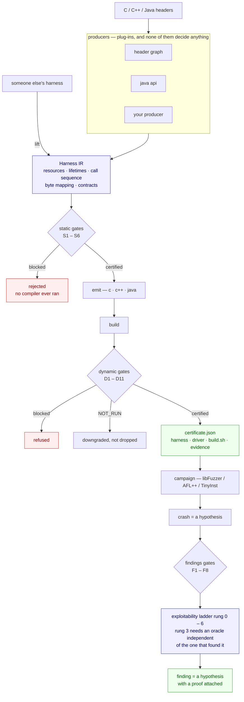

# Harness Forge

**A certification authority for fuzzing harnesses. Generators are plug-ins.**

The field builds generators. The field's own numbers say the generator is not the
bottleneck: harness defects produce false-positive crash rates **as high as 94%**, and an
audit of **586 production harnesses** found 53 protocol violations, 35 of which were fixed
upstream.

That audit was done by [QuartetFuzz](https://arxiv.org/abs/2605.21824), which checks a
harness against four correctness principles **before any fuzzing begins** — so "nobody
checks harnesses up front" would be false, and citing their audit while saying it would be
incoherent. The gap is narrower and it is about the RECORD: a checker returns a verdict,
and a verdict does not tell you which checks ran, which could not, and what the harness
therefore cannot find. When a campaign then reports nothing, there is no way to tell a
clean library from an unexercised one.

So this is not a generator. It is an **IR**, a **gate bank** and an **evidence record**.
A producer proposes a plan; the gates certify it; confidence decides nothing.

---

## Where this stands

<!-- PHASES:BEGIN -->

| phase | | done | |
|---|---|---|---|
| `P1` | IR, static gates, C emitter | 6/6 | **done** |
| `P2` | dynamic gates and positive control | 6/6 | **done** |
| `P3` | producers: test-lift, LLM->IR, graph traversal | 52/63 | partial |
| `PX` | cross-platform hardening: run the same way on every host | 5/5 | **done** |
| `T0` | target choice, seeds and input size: the work that decides findings | 5/5 | **done** |
| `TF` | findings: the half the engine was missing | 5/5 | **done** |
| `M` | the model gets hands on the engine, never on the arbiter | 7/7 | **done** |
| `L` | language coverage beyond C | 8/10 | partial |
| `P4` | lift-and-grade third-party harnesses | 3/4 | partial |
| `P5` | Windows and closed binary | 0/2 | planned |
| `P6` | GUI track | 0/3 | planned |
| `P7` | mobile: Android and iOS | 0/3 | partial |
| `P8` | snapshot and scale | 0/2 | planned |
| `P9` | exotic targets | 0/2 | planned |

**97 of 123 deliverables done**, and `plancheck` refuses to let any of them say so without a module that imports and a test that exists.

<!-- PHASES:END -->

Generated from the manifest by `python3 tools/phase_table.py --write`, because a
hand-maintained status drifts — this one had understated itself by five completed phases.

---

## The pipeline



A gate never returns a boolean. It returns a verdict and the evidence behind it, and
`NOT_RUN` is a **third outcome** — so a check that could not run never reads as one that
passed.

---

## Install

```bash
git clone https://github.com/eobi/harness-forge.git
cd harness-forge
python3 -m hforge doctor
```

There is nothing to install and nothing to configure. **No runtime dependencies, no model, no
API key** — the engine is standard library only, because it has to run where the target
builds: inside an OSS-Fuzz image, on a CI runner, on an air-gapped box.

`doctor` reports what this machine can do and **what each missing tool costs you**, so a
stage that could not run is never mistaken for one that passed.

Every command on this page is written `python3 -m hforge …`, which works straight from a
clone. If you prefer the short form, `pip install -e .` puts an `hforge` executable on your
PATH and the two are interchangeable.

To fuzz anything you also need a **libFuzzer-capable clang**. Apple's `/usr/bin/clang` does
not ship the runtime; on macOS use Homebrew LLVM (`brew install llvm`), and on Linux the
distribution clang has it. `doctor` will tell you which one it found.

---

## Try it

No installation, no build step, nothing beyond a C compiler. Captured from real runs against
the demo library in [`examples/lib/`](examples/lib/), so a clone and a paste gets the same.

### Point it at a library

Nothing here needs a hand-written plan. Give it the public header and the include paths:

Everything below runs from a fresh clone against the demo library in `examples/lib/`, so you
can paste it before pointing the engine at anything of your own:

```console
$ python3 -m hforge propose examples/lib/hf_demo.h --include examples/lib --name hf_demo

4 plan(s) proposed from examples/lib/hf_demo.h, written to build/proposed/

RANK  PLAN                               BLOCK   EDGES  GREW   KILL  SINKS  N/RUN  WARN
--------------------------------------------------------------------------------------
 1    hf_demo_hd_parse                       0       ?     ?    0%    0%      0     0
 2    hf_demo_hd_parse_len64k                0       ?     ?    0%    0%      0     0
 3    hf_demo_hd_parse_n                     0       ?     ?    0%    0%      0     0
 4    hf_demo_hd_parse_n_len64k              0       ?     ?    0%    0%      0     0

UNRANKED. 4 plan(s) are shippable and NO GATE DISTINGUISHES THEM.
The order above is alphabetical, which is a tie-break, not a measurement.
Naming a winner here would be inventing one.
```

That last paragraph is the engine refusing to rank without evidence, which is the behaviour
the rest of this page is about. On a real library the same command scales up — here libyaml,
with paths as they appear inside the benchmark container:

```console
$ python3 -m hforge propose /b/libyaml/include/yaml.h \
    --include /b/libyaml/include --include /b/libyaml/src --name libyaml

116 plan(s) proposed from /b/libyaml/include/yaml.h, written to build/proposed/

RANK  PLAN                               BLOCK   EDGES  GREW   KILL  SINKS  N/RUN  WARN
--------------------------------------------------------------------------------------
 1    libyaml_yaml_alias_event_initiali      0       ?     ?    0%    0%      0     0
 2    libyaml_yaml_alias_event_initiali      0       ?     ?    0%    0%      0     0
 ...
x115  libyaml_yaml_document_get_node_wi      1       ?     ?    0%    0%      0     0
x116  libyaml_yaml_document_get_node_wi      1       ?     ?    0%    0%      0     0

Winner: libyaml_yaml_alias_event_initialize (producer: header_graph).
Selected by gate evidence. No producer supplied a score, a confidence or a preference.
```

An `x` prefix means a static gate blocked that plan; it is reported, not hidden. **Read the
`?` column before the ranking.** `EDGES` is unknown because no campaign has run, so this
ranking is ordered by static evidence alone — and it shows: the plan at the top initialises
an alias event, which is not where YAML parses anything. Static gates prove a harness is not
wrong. They cannot tell you which correct harness is worth running.

That is what `batch` is for. It generates every plan, gates them all, gives the survivors a
real campaign, and ships only what earns it:

```console
$ python3 -m hforge batch /b/libyaml/include/yaml.h \
    --source /b/libyaml/src/api.c --source /b/libyaml/src/parser.c \
    --include /b/libyaml/include --top 32 --campaign-seconds 60
```

`--top` bounds how many get a campaign; the rest are reported as unmeasured rather than as
passing. Add `--classpath` in place of the header to drive the Java producer and the Jazzer
backend instead.

**A C++ class API takes the same command.** A `.hpp`/`.hh` header routes to the C++ producer
automatically; `--lang c++` forces it for a `.h` that is really C++:

```console
$ python3 -m hforge propose /b/pugixml/src/pugixml.hpp \
    --source /b/pugixml/src/pugixml.cpp --name pugixml
```

What it emits for pugixml is an object with a lifetime, and the call repeated across the flag
family the header declares rather than left at one default:

```cpp
std::optional<pugi::xml_document> hf_o_o;
hf_o_o.emplace();
hf_o_o->load_buffer(..., hf_s_d.size(), pugi::parse_minimal);
hf_o_o->load_buffer(..., hf_s_d.size(), pugi::parse_default);
hf_o_o->load_buffer(..., hf_s_d.size(), pugi::parse_full);
```

Parameters it cannot honestly supply are **refused with the reason**, not guessed at. Pass
several headers when the types live apart — this is woff2, whose entry point takes a
**pure-virtual** `WOFF2Out*`, so the plan finds a concrete descendant and gives its
constructor a buffer the harness owns:

```console
$ python3 -m hforge propose /b/woff2/include/woff2/decode.h \
    --also-header /b/woff2/include/woff2/output.h \
    --include /b/woff2/include --source /b/woff2/src/woff2_dec.cc --name woff2
```

```cpp
std::string hf_x_b2{};
std::optional<woff2::WOFF2StringOut> hf_o_a2;
hf_o_a2.emplace(&hf_x_b2);
woff2::ConvertWOFF2ToTTF(..., hf_s_d.size(), &*hf_o_a2);
```

Some libraries need a newer standard than the C++17 default — wabt's `ByteSpan` is
`std::span`, so it wants `--cflag=-std=c++20`, and the emitted build line uses what you
supply rather than adding a second `-std` beside it.

### Grade a harness somebody else wrote

The same gate bank runs against harnesses this engine did not write — yours, or a
generator's you are evaluating:

```console
$ python3 -m hforge audit path/to/their_fuzzer.c
$ python3 -m hforge audit target/classes --classpath app.jar
```

`audit` lifts the harness into the same IR and grades it, so a third-party harness and a
generated one are judged by identical criteria.

**What it does on real code, measured rather than asserted.** Pointed at **372 production
harnesses** from the OSS-Fuzz tree — code that has been fuzzing in Google's fleet for
years:

```console
$ python3 tools/fleet_audit.py path/to/oss-fuzz/projects
harnesses      372
  lifted       358
  high-fidelity  117   (31%)
  flagged          0   candidates, not findings
```

Two numbers and neither flatters us. **Zero flags is a false-positive rate of 0%**,
replacing the "untested at scale" this page used to carry — and it was earned by fixing
seventeen defects in our own lifter and gates, because the first run produced four flags
and every one was our bug rather than theirs.

**Zero findings is the other number.** These are maintained harnesses, so finding nothing
is a plausible honest result; it is also consistent with gates that cannot yet see the
defect classes others report. A census of which gates fire on real code says the second is
live: `S1.LEAK` fires on 57% of the harnesses we trust, because it models per-resource
frees and cannot see a bulk cleanup like apache-httpd's `af_gb_cleanup()`. A signal that
noisy is not a finding, it is an unread one.

**31% is the honest ceiling on all of it.** The other 69% are harnesses this lifter could
not read well enough to have an opinion, and `audit` says so per harness rather than
grading them anyway.

### Handing the harness to a fuzzer

This engine certifies harnesses. It does not hunt bugs with them, and the certificate says
so: it names what the harness *cannot* find. Something still has to run the campaign and
prove what it finds.

[**Nemesis Forge**](https://github.com/eobi/nemesisforge) is built for the second half, on
the same principle as this one — a model may propose, and may certify nothing; oracles that
are deterministic and independent of the proposer decide what a finding is worth. It uses
the **same 0-6 rung ladder** this repository does, which is what lets the two compose
instead of merely coexisting.

Get it — standard library only, no server, no key:

```bash
git clone https://github.com/eobi/nemesisforge.git
cd nemesisforge && python -m forge doctor
```

`doctor` reports which lenses are present **and what each absence costs**, so a null result
is never mistaken for a completed search. Then the whole pipeline:

```console
$ python3 -m hforge propose cJSON.h --include . --name cjson
451 plan(s) proposed

$ python3 -m hforge validate build/proposed/cjson_cJSON_ParseWithLength.hir.json
[PASS] S1..S6   the plan is contract-compliant

$ python3 -m hforge emit build/proposed/cjson_cJSON_ParseWithLength.hir.json -o out
wrote out/harness.c

$ python -m forge lab out/harness.c --fuzz-time 20 \
    --source cJSON.c --include .                         # Nemesis Forge
[22:24:41] job=lab-7d332edd harness=out/harness.c fuzz_time=20s provider=null
[22:25:04] 0 finding(s)
```

Zero findings on cJSON 1.7.18 is the right answer for a pinned release OSS-Fuzz has hammered
for years — and it is only readable beside a positive control, which their tree ships:
`forge lab examples/harness_trunc.c` reaches **rung 1 in 54 executions** on the same machine.

`--source` and `--include` take the library the harness calls into; `out/build.sh` records
the exact build this engine used, so the two agree. Nemesis Forge also exposes an MCP surface
(`python -m forge_mcp --ring2`) whose `nf_lab` accepts the same two, so an agent can drive
certify-then-campaign without a shell.

Getting this to work end to end took four fixes in Nemesis Forge, and the last one is worth
knowing about if you write harnesses by hand. Its C++ detector treated `extern "C"` as
evidence of a C++ harness — when it is the opposite, the guard a C entry point carries to
stay linkable from C++. A correctly guarded harness was compiled as C++, exported the
unmangled symbol its own guard asked for, and then failed to link against a replay driver
that wanted the mangled one. The campaign found a real heap overflow and the oracle
discarded it as a build failure. Both engines now agree on what a correct harness looks
like, which is the point of pairing them.

A **certificate** states what the harness cannot reach. A **finding** states what the
campaign did not prove. Neither hides its gaps, and between them there is no step where
somebody has to take it on trust that the harness was correct — which is the step that
makes most fuzzing results unreviewable.

The pairing is worth more than convenience. Nemesis Forge's harness synthesiser asks a model,
in a prompt, for the properties this engine proves mechanically: do not pass fuzz bytes as a
size or a filename, never leave a required pointer NULL, size output buffers for the one call
that uses them, call only what the public header declares. It then checks one of them — a
coverage probe, after a compiler and a campaign have already been paid for. `S2` and `S4`
refuse those plans before `clang` starts.

`python3 -m hforge audit` runs the same gate bank against harnesses this engine did not write, so a
model-written harness and a generated one are judged by identical criteria.

---

### Pointing it at a target, by platform

The engine is one pipeline with several backends, and they are not equally finished. This
table is the honest state; `python3 -m hforge platforms` prints the full matrix with the
trust ceiling each one carries, and `doctor` reports what your own machine can prove.

| target | status | how you point it |
|---|---|---|
| **Linux CLI** (native or Docker) | verified end to end — 92 tests, 11/11 runnable stages | `python3 -m hforge batch <header> --source ...` |
| **Linux GUI** | early: file-drop driver and AT-SPI dialog automation both PARTIAL, coverage-guided termination PLANNED | not yet a supported entry point |
| **Android CLI** | verified end to end on arm64-v8a API 35: cross-build, push, run, differential | `--platform android-arm64-emulator` |
| **Android GUI** | planned, next after Linux GUI | — |
| **macOS** arm64 | verified end to end | `python3 -m hforge batch ...` natively |
| **C++ class APIs** | measured on two libraries against their own harnesses (woff2 0.99x, pugixml 0.91x); constructs an object for a parameter, including a pure-virtual one; templates, exceptions across the boundary and operator overloads are reported as skipped, not guessed | `python3 -m hforge propose lib.hpp --source lib.cpp` (`.hpp`/`.hh` route automatically; `--lang c++` forces it) |
| **JVM / Java** | Jazzer backend, own gates and sink ladder | `--classpath app.jar` in place of the header |
| **Windows** | exit-code semantics implemented and unit-tested from any host, **never run on a Windows host** | after the mobile track |
| **iOS** | simulator detected via `simctl`; harness emission not yet wired | — |

**Linux, in Docker.** The benchmark image is the reference environment — it fixes the
compiler, the sanitizer and the coverage tooling, so two runs differ in the engine and in
nothing else. Mount the repository read-only and the work directory writable:

```console
$ docker run --rm -v "$PWD:/hf:ro" -v /tmp/hf-work:/b hforge-linuxbench \
    python3 -m hforge batch /b/libyaml/include/yaml.h \
      --source /b/libyaml/src/api.c --source /b/libyaml/src/parser.c \
      --include /b/libyaml/include --top 32 --campaign-seconds 60 -o /b/out
```

`benchmarks/fetch.sh` populates `/b` with every benchmark target at a pinned revision and
writes `versions.json`, so a coverage figure can name the source it describes.

**Android.** The same command with a platform selector. Check what is attached first —
`devices` lists Android devices and iOS simulators, and `selftest` will tell you which
stages your host can actually run rather than reporting a skip as a pass:

```console
$ python3 -m hforge devices
$ python3 -m hforge selftest --abi arm64-v8a --api 29
[ PASS ] android cross-build   arm64-v8a api29 with asan (downgraded from hwasan:
                               stock system image; HWASan needs a HWASan image)
[ PASS ] android device run    emulator-5554: ok
```

That downgrade line is the point: the harness records that it got ASan where it asked for
HWASan, so a certificate never claims a sanitizer the run did not have.

**Roadmap.** P1 and P2 (IR, static gates, C emitter, dynamic gates) are done. P3 producers
and P4 third-party audit are partial. P7 mobile is partial and active. P5 Windows, P6 GUI,
P8 snapshot-and-scale and P9 exotic targets are planned, in roughly that order.

### Reject a bad plan before any compiler runs

```console
$ python3 -m hforge validate examples/hf_demo.broken.hir.json

[PASS] S1  lifetime: created once, destroyed once, never used after
[FAIL] S2  contract: NUL-termination, (ptr,len) pairs, ownership, non-null
        [block] S2.CSTRING: op o_parse: hd_parse requires 'json' to be NUL-terminated,
                but slice 'json' is kind='bytes' and adds no terminator. The library will
                read past the end of EVERY input, so every input becomes a crash and every
                finding is the harness's own.
                fix: set slice 'json' kind to 'cstring', or call the length-delimited
                     variant of hd_parse instead

3 blocking violation(s). This plan must not be emitted as-is.
```

That harness would have produced a crash on the first input and a bug report on the first
day. **No compiler, no campaign, 40 milliseconds.**

### Certify a good one end to end

```console
$ python3 -m hforge certify examples/hf_demo.good.hir.json --campaign-seconds 8

HARNESS CERTIFICATE   hf_demo_parse   [PROVISIONAL]
target      hf_demo 0.1 local        max rung 5 (best: linux-x86_64-glibc)

  PASS  S1..S6   lifetime, contract, ordering, boundary, input flow, error handling
  PASS  D1..D8   liveness, positive control, valid input, sinks, rate, determinism,
                 knobs, campaign productivity
    -   D9   misuse provenance
           reason: no sanitizer report to attribute. This gate runs when a campaign
                   produces a crash, not during certification of a clean harness.
    -   D11  differential consistency across producers
           reason: only 1 buildable plan for this entry point; consistency needs at
                   least two producers to have emitted one

WHAT THIS HARNESS CANNOT FIND
  - any input larger than 4096 bytes cannot be generated
  - leaks are not detected: LeakSanitizer is off
  - uninitialised-memory reads are not detected: MemorySanitizer is off
  - gate D9 did not run: no sanitizer report to attribute
  - gate D11 did not run: only 1 buildable plan for this entry point
```

*(abridged: the gate lines are individually printed, and the platform list and reachability
hypotheses are cut.)* Three things here exist in no other harness generator I know of.

**`-` is not `PASS`.** D9 and D11 did not run, and the certificate says so in the same
column, with the reason. A missing check never reads as a satisfied one.

**`WHAT THIS HARNESS CANNOT FIND` is generated**, computed from the knobs and sanitizers
actually in force. When this harness reports nothing, that block is the honest scope of the
silence — the difference between "no bugs" and "no bugs *of the kinds this configuration can
observe*".

**`[PROVISIONAL]`** because `max rung 5`: the ladder's top rung needs an oracle independent
of the one that found the crash, and certification alone cannot supply it.

### The rest

| | |
|---|---|
| `propose <header> --source <c> --dynamic` | ranks candidate plans by **mutation kill rate**, not by anyone's preference |
| `audit <their-harness.c>` | grades a harness somebody else wrote; low-fidelity lifts are tracked separately and never scored as defects |
| `batch --target <name> --source <dir>` | every plan for a target, gated, campaigned, and only the ones that reach code get shipped |
| `doctor` / `selftest` | what this machine can do, and what each missing tool **costs** |

Against libmagic, `batch` proposed 36 plans, rejected 2 before a compiler ran, shipped 26,
and refused 10 for reaching fewer than 8 edges — **28% of what a conventional generator would
ship reaches essentially nothing**, identified in under a minute. More in
[`docs/EVIDENCE.md`](docs/EVIDENCE.md).

## Beyond this page

| | |
|---|---|
| [`docs/EVIDENCE.md`](docs/EVIDENCE.md) | the measured claims — detection rates, mined dictionaries and seeds, scale, ten real libraries, and the two limitations and what closing them cost |
| [`docs/PLATFORMS.md`](docs/PLATFORMS.md) | the 24-platform matrix with trust ceilings, and how to verify Linux on your own machine |
| [`benchmarks/RANKING.md`](benchmarks/RANKING.md) | the full protocol, the denominator rule, and what is deliberately not measured |
| [`SECURITY.md`](SECURITY.md) | disclosure, and why nothing here will call a finding a zero-day |
| [`CONTRIBUTING.md`](CONTRIBUTING.md) | adding a producer, a gate, or a benchmark case |

---

## Why an IR

Every published generator emits C for one backend. A harness validated for libFuzzer on
Linux tells you nothing about the same API under TinyInst on Windows, and its defects are
only discoverable by compiling and running it.

Here a harness is a **plan**: a resource graph with lifetimes, a call sequence, a mapping
from fuzzer bytes to arguments, and the API contracts the plan must respect.

1. **One plan, many backends.** The same IR emits a libFuzzer harness, an AFL++ persistent
   loop, a TinyInst in-process driver, a GUI file-drop driver, or an interpreter program.
   Certified semantics travel across OS and architecture.
2. **Gates before compilation.** Lifetime correctness, protocol compliance and ordering are
   properties of the plan.
3. **The IR is the certifiable artifact.** Versionable, diffable, publishable.
4. **Third-party harnesses lift into it**, so somebody else's C can be graded.

---

## The gates

**Static — on the plan, before a compiler exists**

| | | principle |
|---|---|---|
| S1 | lifetime: created once, destroyed once, never used after | P1 |
| S2 | contract: NUL-termination, (ptr,len) pairs, ownership, non-null | P2 |
| S3 | ordering: create before use before destroy | P2 |
| S4 | boundary: public interface only | P3 |
| S5 | input flow: the fuzzer's bytes reach the target | P4 |
| S6 | error handling: failure returns checked before use | P1 |

**Dynamic — against a build**

| | | phase |
|---|---|---|
| D1 | liveness: the target call survived the optimiser | 1 |
| D2 | positive control: the harness finds a planted bug | 2 |
| D3 | valid input must not crash | 1 |
| D4 | sink reachability | 2 |
| D5 | execution rate is plausible | 1 |
| D6 | determinism, reported as a **rate** | 1 |
| D7 | knobs recorded, and **what they exclude computed** | 1 |
| D9 | misuse provenance | 2 |
| D11 | differential consistency across producers | 2 |

A gate never returns a boolean. It returns a verdict plus the evidence, and **NOT RUN is a
distinct outcome** so an absent check never reads as a passed one.

---

## Findings: harnesses this engine graded, and the defects it found

Updated 2026-08-31. **Two upstream-reportable defects, both filed, both verified against the
library's own source before filing rather than against our own verdict.**

| | defect | filed |
|---|---|---|
| 0001 | bluez `fuzz_gobex.c` leaks a `GError` on every failed decode | [google/oss-fuzz#16081](https://github.com/google/oss-fuzz/pull/16081) |
| 0002 | leptonica `pix3_fuzzer.cc` passes NULL to three functions it means to test | [DanBloomberg/leptonica#813](https://github.com/DanBloomberg/leptonica/pull/813) |

Write-ups with full evidence are in [`findings/`](findings/).

**0001 is worth a second look.** `projects/bluez/build.sh` sets `detect_leaks=0` for that
target and for no other bluez target, and it is the only bluez harness touching a `GError`.
The workaround and the defect line up, and the cost is that the target can no longer report
a leak *in gobex itself*. A harness defect had quietly removed a whole bug class from the
library's coverage — which is the negative-capability argument this project exists to make,
found in the wild rather than argued from a bench.

**0002 is silent rather than loud.** `pixDestroy` nulls the pointer and each entry point
returns on `!pix`, so three functions are never executed on any input while the fuzzer, the
coverage report and the maintainer all believe they are under test.

### The corpus

| corpus | harnesses | lifted | trusted | blocking |
|---|---:|---:|---:|---:|
| OSS-Fuzz tree | 420 | 400 | 126 | 0 |
| upstream project repositories | 2,273 | 1,542 | 286 | 2 |
| **total** | **2,693** | 1,942 | **412** | 2 |

QuartetFuzz audited 586 harnesses across 70 projects. The upstream corpus is harvested by
shallow-cloning each OSS-Fuzz project's own repository, copying out its harnesses and
deleting the clone, so disk stays flat.

### The gates' false-rejection rate

**Zero on trusted lifts.** Production harnesses are presumed-good by construction, so a
blocking verdict on one is a false rejection unless triage shows the harness is genuinely
defective. After reading every one: **412 trusted lifts, 2 blocking verdicts, 0 false
positives.**

Both survivors are correct. `leptonica/pix3_fuzzer.cc` is the real defect above.
`bazel-rules-fuzzing/oom_fuzz_test.cc` calls no library function and consumes no input —
which is exactly what the gates say about it, and exactly what its own header describes:
*"A fuzz target that creates a memory leak and causes OOM errors."* A fixture built to be
broken, correctly identified.

QuartetFuzz reports 4.8%. **The denominators are not comparable and the difference is the
point:** we trust 412 of 1,942 lifts, 21%, and decline to opine on the rest, while their
figure covers everything they judged. **0.00% is a rate on the tier this engine trusts, not
on everything it sees, and it should never be quoted without that sentence.** We buy precision by abstaining. Across *all* lifted
harnesses 28.8% carry a blocking violation, and that number is recorded beside the good one
deliberately — the fidelity filter measures our own comprehension, not harness quality.

### What the triage actually cost

Roughly 45 candidates have been read by hand. **Two were real; the rest were defects in
this engine**, and fixing them is what made the two visible. That ratio is the honest
headline: a gate bank is an instrument, and most of the work is calibrating it rather than
reading its output.

---

## What these harnesses cannot find

[`tools/bounds.py`](tools/bounds.py). This is the half of the thesis that had never been
published: a certificate should state what a harness **cannot** find, because a campaign
reporting nothing is otherwise ambiguous — the library may be clean, or the harness may
never have been able to see the defect. Coverage does not settle it, since a harness can
execute a function thoroughly with the detector for its whole bug class switched off.

Surveyed across the OSS-Fuzz tree, reading build configuration rather than inferring:

| bound | projects | what becomes invisible |
|---|---:|---|
| `detect_leaks=0` | **115** | memory leaks in the library |
| `max_len=N` | 24 | any defect needing a longer input |
| `allocator_may_return_null=1` | 5 | allocation-failure handling |
| `detect_odr_violation=0` | 1 | one-definition-rule mismatches |

**115 of 1,374 projects — 8.4% — cannot report a leak**, and nothing in their campaign
output says so.

This is not an accusation: a project may disable a detector for a good reason, and often
does. What is not reasonable is a campaign reporting nothing while a whole class is off and
no artifact records it. Every signal above is a literal setting in a build file, never an
inference — a bound nobody can check is worth nothing.

**It found the case that motivated it.** bluez appears in the leaks-disabled list, and
[finding 0001](findings/) is a `GError` leaked on every failed decode in the one bluez
harness that touches a `GError` — the same target whose leak detection is off. The bound and
the defect are the same fact seen from two sides.

## Widening the candidate space

[`hforge/producers/mutate.py`](hforge/producers/mutate.py). OGHarn (ICSE 2025) beats
developer-written harnesses by **+14% median coverage** through mutational stitching
filtered by dynamic oracles — compilation, execution, coverage — so every rejected candidate
has already cost a compile and a campaign slot.

`benchmarks/probe_select.py` established that our gap is **not the ranking**: the static
rule is 0.63 points behind the best available candidate on libyaml, against a run-to-run
variance of 3.55 on that same case, and 0.00 behind on libpng. It is the **candidate
space**. The header graph proposes one plan per consuming entry point and never calls a
function belonging to a different entry point against the same object.

| library | valid base plans | with mutation | growth | gate rejection |
|---|---:|---:|---:|---:|
| jansson | 8 | **114** | **14.2x** | 33.8% |
| expat | 196 | **3,252** | **16.6x** | 0.8% |

Mutations are **enumerated, not sampled**: same inputs, same candidates, same order, no seed
to record.

**The coverage target is not met and is not claimed.** +14% median against developer-written
harnesses requires building and campaigning these candidates. Volume is the means; coverage
is the result, and only the means is demonstrated.

## Measured against the state of the art

Against **QuartetFuzz** — the strongest published LLM-driven harness generator, 3 CVEs, 29
confirmed reports — on its own 100-case benchmark with its gold OSS-Fuzz baselines.
**The protocol is theirs and it favours them:** gold and QuartetFuzz are the median of ten
600 s runs, ours is **one**.

### 600 s per case, Linux aarch64, clang 14

<!-- BENCH:BEGIN -->

| case | ours | QuartetFuzz | gold | ours/gold | QF/gold |
|---|---|---|---|---|---|
| libyaml/libyaml_loader_fuzzer | **73.77** | 73.89 | 77.7 | 0.95x | 0.95x |
| libyaml/libyaml_scanner_fuzzer | **70.36** | 67.30 | 70.6 | 1.00x | 0.95x |
| brotli/decode_fuzzer | **84.45** | 84.15 | 77.2 | 1.09x | 1.09x |
| yajl-ruby/json_fuzzer | **72.72** | 79.87 | 69.1 | 1.05x | 1.16x |
| iperf/cjson_fuzzer | **24.82** | 0.00 | 24.5 | 1.01x | 0.00x |
| zopfli/zopfli_deflate_fuzzer | **78.81** | 80.06 | 85.7 | 0.92x | 0.93x |
| zlib/zlib_uncompress2_fuzzer | **51.91** | 51.74 | 53.1 | 0.98x | 0.97x |
| lcms2/cmsOpenProfileFromMem | **5.00** | — | — |  |  |
| libde265/stream_decode | **13.79** | — | — |  |  |
| jbig2dec/jbig2_data_in | **2.58** | — | — |  |  |
| leptonica/pixReadMem | **14.48** | — | — |  |  |
| jansson/json_loadb | **35.20** | — | — |  |  |
| libwebp/WebPDecodeRGBA | **50.73** | — | — |  |  |
| libpng/png_image_begin_read_from_memory | **7.73** | — | — |  |  |
| expat/XML_Parse | **31.43** | — | — |  |  |
| zstd/ZSTD_decompress | **29.92** | — | — |  |  |
| mbedtls/mbedtls_x509_crt_parse | **31.92** | — | — |  |  |
| pugixml/parse | **14.79** | — | 14.79† | 1.00x |  |
| woff2/convert | **41.49** <sub>n=6 ±23.98</sub> | — | 33.20† <sub>n=6 ±19.91</sub> | *n.s. (p=0.94)* |  |
| wabt/read_binary_ir | *build failed* | — | — |  |  |

† gold MEASURED by this repository from the project's own in-tree harness, not cited. Same machine, same compiler, same 600 s, same file list, and a fresh corpus from the same seeds — so the comparison differs in the harness and in nothing else.

Measured cases with a gold baseline: **9**. Median ours/gold: **1.00x**. Ahead of the cited QuartetFuzz figure on **4 of the 7** cases it published one for.

Sources: run-001-quartetfuzz-6case, run-005-partial, run-007-partial-4of7, run-009, run-010, run-011, run-012, run-013, run-014, run-015, run-016, run-017, run-018, run-019, run-020, run-021, run-022, run-023, run-024, run-026, run-028, run-029, run-030, run-031, run-032, run-033, run-034, run-035, run-036, run-037, run-038, run-040, run-041, run-042, run-043, run-044, run-045.

<!-- BENCH:END -->

**The C++ cases.** `pugixml/parse` and `woff2/convert` are the first genuine C++ class
APIs in the suite -- objects with constructors and destructors, not C behind an
`extern "C"` façade. Both are measured against the project's own in-tree harness, built
here under identical conditions:

| case | ours | its own harness | ratio |
|---|---:|---:|---:|
| woff2/convert | 41.49% (n=5) | 29.88% (n=5) | *no significant difference, p=0.55* |
| pugixml/parse | **14.79%** (n=5, ±0.00) | 14.79% (n=5, ±0.49) | **1.00x** |

**woff2 is the one that shows what the producer is doing.** Its entry point is
`ConvertWOFF2ToTTF(data, len, WOFF2Out* out)`, and `WOFF2Out` is **pure virtual** -- there
is no object to pass. From the headers alone the plan resolves it to a concrete descendant
and gives that constructor a buffer the harness owns:

```cpp
std::string hf_x_b2{};
std::optional<woff2::WOFF2StringOut> hf_o_a2;
hf_o_a2.emplace(&hf_x_b2);
woff2::ConvertWOFF2ToTTF(data, size, &*hf_o_a2);
```

which is, apart from a `SetMaxSize` guard, the harness woff2's own authors wrote. Neither
side had a seed corpus, so both started cold -- fair against each other, and **not**
comparable to the 87.3% `dataset_v2` publishes for that harness, which had OSS-Fuzz's
accumulated corpus behind it.

**woff2, measured five times each under the corrected driver — and the answer is "we
cannot tell".**

| | samples | median | spread |
|---|---|---:|---:|
| ours | 29.46, 32.86, 41.49, 44.23, 45.89 | 41.49% | 16.4 |
| its own harness | 26.89, 29.71, 29.88, 41.16, 46.80 | 29.88% | 19.9 |

The ratio of medians is **1.39x**, and reporting that as a 39% advantage would be wrong.
The two distributions almost completely overlap, 64% of pairwise comparisons favour us,
and an exact two-sided Mann-Whitney test gives **p = 0.55**. On this target, five runs
cannot distinguish our harness from the developer's. The campaign starts from an empty
corpus with no fixed libFuzzer seed, and on a format where a valid container must be
constructed before the decoder is reached at all, run-to-run luck dominates everything
else.

**This is the single most useful number on this page**, because it is the one that would
have been easiest to publish wrongly. A median is not a result; a median with a spread
wider than the difference it is being used to claim is not even a hint. pugixml's coverage
does not move at all across five runs, libyaml's spans 3.55 points across nine, and woff2
spans sixteen — so there is no such thing as "fuzzing variance" as a number you measure
once and reuse.

**The pugixml case is a prediction that was tested.** The first measurement put our
harness at **13.47%** against the project's own `tests/fuzz_parse.cpp` at 14.79% — 0.91x —
and the gap had a stated cause rather than a shrug: the gold harness calls `load_buffer`
three times, with `parse_default`, `parse_minimal` and `parse_full`, and ours called it
once, because `options` is a defaulted parameter and the producer drops defaulted
parameters rather than guessing a value for them.

That is a falsifiable claim about where 1.32 points live, so it was built and re-measured.
The producer now reads the flag family out of the header — every constant sharing the
default's prefix, of which the **least** is the bare zero (`parse_minimal = 0x0000`), the
**default** is what the signature names, and the **most inclusive** is the one whose
expression references the most other members (`parse_full`) — and repeats the call across
the three. That derives exactly the values pugixml's own authors chose, with no
per-library list, and the emitted source passes them as named constants so what the
harness does stays auditable.

Re-measured over five repeats: **14.79%**, which is the developer harness's median. The
predicted gap closed, and it closed for the predicted reason.

**Read the dispersion beside it, because it corrected us.** After three repeats both
harnesses looked perfectly deterministic. The fourth put *gold* at 15.28%. So ours is
stable across five runs (±0.00) and the developer's is not (±0.49), and "both are
deterministic" was an artifact of stopping at three. Executions vary by 20% throughout, on
both sides, without moving our coverage at all — so on this target the campaign is noisy
and the coverage is not, which is the opposite of libyaml, where nine runs of a
byte-identical harness spanned 3.55 points. **The noise floor is a property of the target,
not a constant you can measure once and reuse.**

**A useful cross-check falls out of this case.** `dataset_v2` publishes a gold of 15.27% for
`pugixml/fuzz_parse` over 7,734 lines; we measure that same in-tree harness at 14.79% over
7,567. **0.48 points apart, with denominators 2.2% apart.** For libyaml our denominator and
theirs differ by 48%, which is why no cross-tool comparison is claimed there. That the two
agree closely here is evidence the libyaml gap is that target's build configuration rather
than a systematic difference in how the two projects count lines -- one case, not a proof,
but it narrows where to look.

> **Every `ours/gold` ratio above is pending re-measurement, and the bias runs in our
> favour.** Found 2026-08-30: the D3 gate ("valid input must not crash") ran the harness
> for 400 executions against the campaign's own corpus directory, and libFuzzer writes
> newly-interesting inputs back into any corpus directory it is given. So our campaign
> started with inputs a fuzzer had already discovered, while the developer's harness --
> which does not run our gates -- started from the mined seeds alone. On a case with no
> mined seeds the effect is the whole starting corpus: ours began with a handful of
> discovered inputs, gold with nothing.
>
> The gate now runs against a copy in its own directory, so both harnesses start from the
> same inputs, and the fix is in. The numbers above were taken before it and have not yet
> been re-run. They are left in place rather than deleted, because removing them would
> hide the size of the correction when it arrives.

### What this table does not establish

Four limits, stated because the numbers above are easy to over-read.

**It shows parity, not superiority.** The median is **0.99x**, and it is worth saying how
that number arrived. Until run-026 this table read 1.02x, measured against source trees
cloned by hand at unrecorded revisions. Re-running every case against pinned sources moved
the median to 0.99x -- from a shade ahead of the hand-written harness to a shade behind it.
The spread across the six head-to-head cases is 0.89x (zopfli) to 1.10x (brotli), and only
brotli is plausibly outside the run-to-run noise of a single campaign. The defensible claim
is that an engine with no model in the loop reaches roughly what the hand-written harness
reaches. It is not a claim of beating gold, and the earlier number should not be quoted.

**Our figures are single runs; theirs are medians of ten.** That asymmetry is stated above,
but its size was not measured until run-025 re-ran the suite against pinned sources:
`libyaml/libyaml_loader_fuzzer` moved from 77.77 to 73.16, 4.6 points, on a case that had
looked stable. Whether that is the version pin or ordinary campaign variance is not yet
separated. Until this repository runs repetitions, ratios here should not be read to two
decimal places.

**The seven head-to-head cases are not a representative sample.** Their gold coverage
averages 62.3%. Across QuartetFuzz's full 100-case set the gold median is 18.06%, ranging
from 0.20% to 87.32%. These seven are the targets where a harness can get deep, and a
parser-shaped engine looks better on them than it would on a hundred.

**The gold column has been superseded for three of the seven.** These figures come from the
artifact's `dataset/gold_baseline_100.jsonl`, whose protocol is not documented there. The
authors' newer `dataset_v2` re-measures gold by replaying each project's official OSS-Fuzz
corpus, scoped to the project's own sources, and disagrees where the two overlap: libyaml
scanner 70.6 -> 53.2, libyaml loader 77.7 -> 78.2, zlib 53.1 -> 55.4. The remaining four
cases are not in that set, so switching columns piecemeal would mix two protocols in one
table. The honest resolution is to run the newer set, not to relabel these rows.

**`ours/gold` is the number that matters.** Absolute coverage is a property of the target —
85% on brotli and 53% on zlib say nothing about each other. For scale, QuartetFuzz's own
median across its 25 C cases is **0.95x**: the state of the art is still, on median, slightly
behind the hand-written harness it is replacing.

**`iperf/cjson_fuzzer`, QuartetFuzz 0.00** — not a low score, no working harness at all. That
is the failure mode the gate bank exists to make visible.

**`lcms2` has no baseline in this table** because it is not in QuartetFuzz's evaluation
set. An earlier draft said no public OSS-Fuzz harness existed for the entry point and that a
model could not have memorised it. Both were false: OSS-Fuzz ships `cms_md5_fuzzer`, which
calls `cmsOpenProfileFromMem` directly. That harness replays its official corpus to
**5.107%** against a denominator of its own, beside the **5.14%** measured here — not a
cell-to-cell comparison, but close enough to suggest ~5% is simply what one entry point
reading an ICC profile reaches. The row earns its place a different way: pointing the engine
at lcms2 found **five defects in this engine** that seven benchmark cases never exposed.

**`libde265`'s gold figure is one we measured**, marked †: the project ships its own harness,
so we built theirs and ran it here under identical conditions. It disproved what we expected.
Our plan calls `de265_decode` once where theirs pumps it in a loop — a real gap that cost
**0.25 points**, because the entire H.265 decode core is at **0.00% for the hand-written
harness too**. On that target the input is the bottleneck, not the harness.

Protocol, the denominator rule and its ceiling argument, and what is deliberately not
measured: [`benchmarks/RANKING.md`](benchmarks/RANKING.md).

**QuartetFuzz has 3 CVEs. This repository has none.** Coverage is instrumentation, not the
product.

---

## Layout

```
hforge/
  ir.py            the Harness IR — resources, lifetimes, ops, slices, scratch
  manifest.py      every deliverable, its status, and what backs it
  producers/       header_graph (C) · cxx_header · java_api · rank · mutate
  emit/            the language router, then c_libfuzzer · cxx_libfuzzer · java_jazzer
  gates/           static_gates S1..S6 · dynamic_gates D1..D11
  findings/        F1..F8, the exploitability ladder, our own false-positive rate
  java/            the parallel JVM track   lift/  grade someone else's C
  analysis/        sink map, mined dictionaries, mined seeds
findings/          upstream-reportable defects, with the evidence for each
benchmarks/        drive.py · rank.py · run.sh · reference.json · results/logs/
benchmarks/audits/ fleet audits: what the gate bank said about somebody else's harnesses
tools/             plancheck · plandrift · fleet_audit
examples/lib/      a tiny demo library, so this runs on a clean clone
docs/              EVIDENCE.md — the measured claims   PLATFORMS.md — the matrix
```

## Checks

```
pip install pytest && python3 -m pytest -q     # 345 passed
python3 tools/plancheck.py                     # repository vs manifest: no drift
python3 -m hforge selftest                     # the pipeline, end to end, on this machine
```

326 tests across eleven files, each pinning a failure that really happened rather than a
function that exists. **`plancheck` is a gate, not a report**: every deliverable the manifest
marks `DONE` must name a module that imports and a test that exists, and CI fails when one
does not. That is what makes the status table above worth reading.

---

## Questions this answers

**How do I know my fuzzing harness is correct?**
Run the gates on it. `python3 -m hforge validate <plan>` checks six static properties with no compiler
involved; `python3 -m hforge certify` adds eleven dynamic ones and writes a certificate. A harness this
engine passes still has limits, and the certificate names them under
`WHAT THIS HARNESS CANNOT FIND` rather than leaving you to discover them later.

**Why does my fuzzer keep reporting false positives?**
Usually the harness, not the library. The field's own numbers put harness-caused
false-positive crash rates as high as **94%**. The classic causes are fuzzer bytes bound to a
size, length, index or filename; a required pointer passed as NULL; and an output buffer
sized for a different call. `S2` refuses all three before `clang` runs.

**How do I write a libFuzzer harness for a C library?**
You do not have to. Point the engine at the public header:
`python3 -m hforge batch <header> --source lib.c --include dir/`. It proposes every plan the API admits,
gates them, campaigns the survivors, and ships only the ones that earn it.

**My harness builds and runs but finds nothing. Why?**
Three usual reasons, and the engine distinguishes them. It never enters library code (D1/D3
catch it); it has no seeds for a format a mutator cannot reach by chance; or the entry point
genuinely cannot reach much, in which case the denominator is the problem and not the
harness. On mbedTLS, adding eleven real X.509 certificates moved coverage from 12.22% to
27.08% **on a campaign one tenth as long**.

**Can an LLM write fuzz harnesses?**
Yes, and the good generators are LLM-driven. This engine is the other half: it does not
generate with a model at all, and it grades harnesses whichever way they were written.
`python3 -m hforge audit <harness.c>` runs the same gate bank over somebody else's harness, so a
model-written one and a generated one are judged by identical criteria.

**How do I audit existing OSS-Fuzz harnesses at scale?**
`python3 -m hforge audit <dir>` lifts every harness it finds into the IR and grades it. Violations are
reported with the fix, and a harness the lift cannot read with confidence is marked low
fidelity rather than silently passed.

**What is the difference between this and a fuzzer?**
A fuzzer runs a harness and finds crashes. This proves the harness was worth running and
states what it cannot find. For the campaign and the crash triage, pair it with
[Nemesis Forge](https://github.com/eobi/nemesisforge), which shares the same rung ladder.

**Does it need an API key, a server, or a network?**
No. There are no runtime dependencies at all — standard library only — because the engine
runs where the target builds: inside an OSS-Fuzz image, on a CI runner, on an air-gapped box.

---

## Citing this work

GitHub renders a **Cite this repository** button from [`CITATION.cff`](CITATION.cff).

```bibtex
@software{obiebukadavid_harnessforge_2026,
  author  = {{Obi Ebuka David}},
  title   = {{Harness Forge}: a certification authority for fuzzing harnesses},
  year    = {2026},
  version = {0.1.0},
  url     = {https://github.com/eobi/harness-forge},
  license = {Apache-2.0},
  note    = {Department of Computer Science, University of Dayton, Ohio, USA}
}
```

The double braces are deliberate: without them most BibTeX styles reorder the name to
"David, O. E."

> Obi Ebuka David (2026). *Harness Forge: a certification authority for fuzzing harnesses*
> (version 0.1.0) [Computer software]. Department of Computer Science, University of
> Dayton, Ohio, USA. https://github.com/eobi/harness-forge

**Cite the commit, not the branch.** Three producer fixes landed within twenty minutes of
run-009's last case finishing, and any one changes what a harness looks like — which is why
every row in [`benchmarks/results/`](benchmarks/results/) carries the engine revision that
emitted its harness, `-dirty` included. Add `note = {Commit f2f55b7}`. For a DOI, enable
Zenodo and cut a release; it reads `CITATION.cff` directly.

**Citing a number rather than the software?** Cite the run. Each figure is reproducible from
the row (`benchmarks/results/<run-id>.jsonl`), the evidence
(`benchmarks/results/logs/<run-id>/<case>/`) and the command (`benchmarks/run.sh`). And carry
the distinction the tables carry: a figure this repository **measured** and one someone else
**published** are different kinds of evidence — see [`THIRD-PARTY.md`](THIRD-PARTY.md).

## Licence

Apache-2.0. See [LICENSE](LICENSE).
